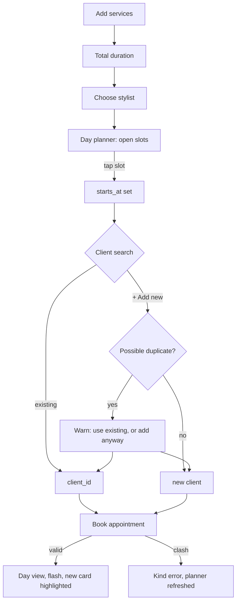

# Booking flow

> Status: the simplest case is implemented — an existing client, one service, a typed date and time (`appointments#new`/`#create`, `resources :appointments, only: [:show, :new, :create]`). Not yet built: several services (add/remove rows), the day planner, client search + inline creation, the duplicate warning, and friendly clash handling (today a clash just re-renders the form with `Appointment`'s existing validation message via `shared/_errors`). The order below is the agreed target shape; what's built so far is a plain form, not this flow.

## Intent
Follow how the conversation at the desk goes: *"She wants a cut and a gloss, ideally with Melissa, sometime Wednesday."* The front desk and stylists both book, so the flow must be quick on a phone between clients too.

1. **Services**: one or more. Each gets a duration from the service default, adjustable for this visit. The total shows as you go ("90 min").
2. **Stylist**: preselected from the client's preferred stylist when the client is already known.
3. **Moment**: tap an open slot in the day planner ("Find the right moment"), or type a time.
4. **Client**: one search box. Matches appear as you type, and the last option is always *"+ Add "Jane Doe" as a new client"*. See [../clients/summary.md](../clients/summary.md) for the duplicate warning.
5. **Notes** (optional), then **Book appointment** / **Never mind**.



## Services as nested fields
Services are `appointment_services` nested attributes (`form.fields_for :appointment_services`, matching `Appointment#accepts_nested_attributes_for`). Today `app/views/appointments/_form.html.erb` renders exactly one line (`@appointment.appointment_services.build` in `new`, with `position` hardcoded to `1` in a hidden field) — client, stylist, and service are all plain styled `collection_select`s (see [../ui/design-tokens.md](../ui/design-tokens.md) for `select_chevron`), and the moment is one `datetime_local_field` the front desk types into directly. Add/remove rows, below, is still planned.

A small Stimulus controller will add and remove rows from a `<template>`, a standard Rails pattern with no gem needed.

```erb
<%# app/views/appointments/_form.html.erb (excerpt) %>
<div data-controller="service-lines">
  <template data-service-lines-target="template">
    <%= form.fields_for :appointment_services, AppointmentService.new, child_index: "NEW" do |line| %>
      <%= render "appointments/service_line", line: %>
    <% end %>
  </template>
  <%= form.fields_for :appointment_services do |line| %>
    <%= render "appointments/service_line", line: %>
  <% end %>
  <div data-service-lines-target="anchor"></div>
  <button type="button" data-action="service-lines#add">+ Add a service</button>
</div>
```

## Day planner (Turbo Frame)
The planner reloads when the services, stylist, or date change. Before a stylist is chosen, it shows every stylist's openings for the day, so it is never an empty box. Slots are buttons carrying the time; tapping one fills the hidden `starts_at` field.

```js
// app/javascript/controllers/planner_controller.js (excerpt)
refresh() {
  const url = new URL(this.frameTarget.src, window.location.origin)
  url.searchParams.set("stylist_id", this.stylistTarget.value)
  url.searchParams.set("minutes", this.totalMinutes())
  this.frameTarget.src = url.toString()
}
```

## Creating a client inline (planned; today the client must already exist)
New clients will be created in the same transaction as the appointment, so a failed booking leaves no orphan client. The current `create` (below) is the subset of this that exists now:

```ruby
# app/controllers/appointments_controller.rb (current)
def create
  @appointment = Appointment.new(appointment_params)
  if @appointment.save
    redirect_to root_path(date: @appointment.starts_at.to_date),
      notice: "Booked. #{@appointment.client.name} is in with #{@appointment.stylist.name} at #{@appointment.starts_at.strftime('%-l:%M')}."
  else
    render :new, status: :unprocessable_entity
  end
end
```
Inline client creation (wrapping the above in `Appointment.transaction`, building `@appointment.client` from `new_client_params` when no `client_id` is chosen) arrives with the client search box.

## Rules
- `ends_at` is derived from `starts_at` plus the total of the services (see [../scheduling/overlap-prevention.md](../scheduling/overlap-prevention.md)).
- A new client's preferred stylist defaults to the appointment's stylist.
- Editing an existing client's contact details happens in Clients, not here.
- Editing an appointment uses the same form with eyebrow "A change of plans".
