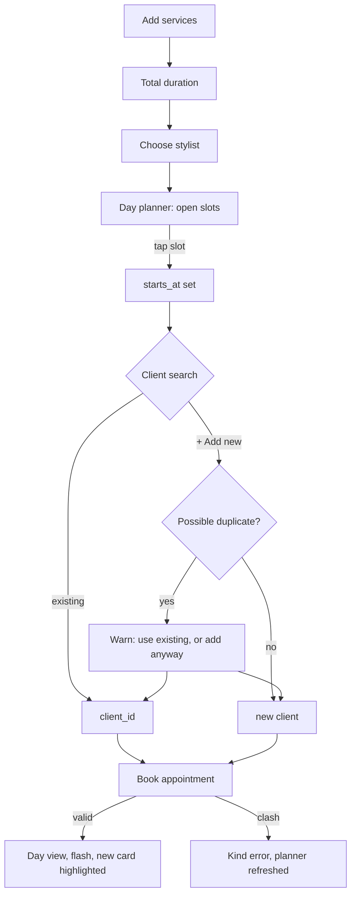

# Booking flow

> Status: planned, not yet implemented. The order is the agreed starting point; adjust it if it doesn't flow well in practice.

## Intent
Follow how the conversation at the desk goes: *"She wants a cut and a gloss, ideally with Melissa, sometime Wednesday."* The front desk and stylists both book, so the flow must be quick on a phone between clients too.

1. **Services**: one or more. Each gets a duration from the service default, adjustable for this visit. The total shows as you go ("90 min").
2. **Stylist**: preselected from the client's preferred stylist when the client is already known.
3. **Moment**: tap an open slot in the day planner ("Find the right moment"), or type a time.
4. **Client**: one search box. Matches appear as you type, and the last option is always *"+ Add "Jane Doe" as a new client"*. See [../clients/summary.md](../clients/summary.md) for the duplicate warning.
5. **Notes** (optional), then **Book appointment** / **Never mind**.



## Services as nested fields
Services are `appointment_services` nested attributes. A small Stimulus controller adds and removes rows from a `<template>`, a standard Rails pattern with no gem needed.

```erb
<%# app/views/appointments/_form.html.erb (excerpt) %>
<div data-controller="service-lines">
  <template data-service-lines-target="template">
    <%= form.fields_for :appointment_services, AppointmentService.new, child_index: "NEW" do |line| %>
      <%= render "appointments/service_line", line: %>
    <% end %>
  </template>
  <%= form.fields_for :appointment_services do |line| %>
    <%= render "appointments/service_line", line: %>
  <% end %>
  <div data-service-lines-target="anchor"></div>
  <button type="button" data-action="service-lines#add">+ Add a service</button>
</div>
```

## Day planner (Turbo Frame)
The planner reloads when the services, stylist, or date change. Before a stylist is chosen, it shows every stylist's openings for the day, so it is never an empty box. Slots are buttons carrying the time; tapping one fills the hidden `starts_at` field.

```js
// app/javascript/controllers/planner_controller.js (excerpt)
refresh() {
  const url = new URL(this.frameTarget.src, window.location.origin)
  url.searchParams.set("stylist_id", this.stylistTarget.value)
  url.searchParams.set("minutes", this.totalMinutes())
  this.frameTarget.src = url.toString()
}
```

## Creating a client inline
New clients are created in the same transaction as the appointment, so a failed booking leaves no orphan client.

```ruby
# app/controllers/appointments_controller.rb (excerpt)
def create
  @appointment = Appointment.new(appointment_params)
  Appointment.transaction do
    @appointment.client ||= Client.create!(new_client_params) if new_client_params[:name].present?
    @appointment.save!
  end
  redirect_to calendar_path(date: @appointment.starts_at.to_date),
              notice: "Booked. #{@appointment.client.name} is in with #{@appointment.stylist.name} at #{@appointment.starts_at.strftime('%-l:%M')}."
rescue ActiveRecord::RecordInvalid
  render :new, status: :unprocessable_entity
end
```

## Rules
- `ends_at` is derived from `starts_at` plus the total of the services (see [../scheduling/overlap-prevention.md](../scheduling/overlap-prevention.md)).
- A new client's preferred stylist defaults to the appointment's stylist.
- Editing an existing client's contact details happens in Clients, not here.
- Editing an appointment uses the same form with eyebrow "A change of plans".
