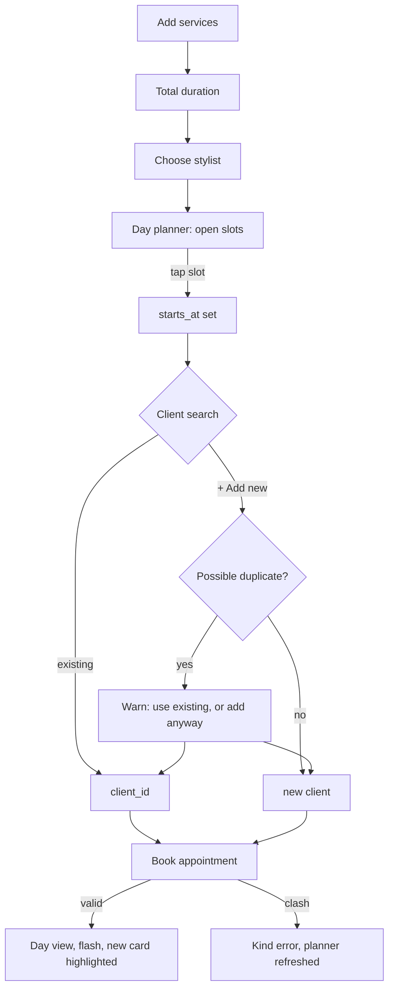

# Booking flow

> Status: an existing client, one or several services (picked from `Service.active`, see below), and a typed date and time (`appointments#new`/`#create`, `resources :appointments, only: [:show, :new, :create]`), opening as a modal like appointment detail (see below). Not yet built: the day planner, client search + inline creation, the duplicate warning, and friendly clash handling (today a clash just re-renders the form with `Appointment`'s existing validation message via `shared/_errors`). The order below is the agreed target shape; what's built so far is a plain form, not this flow.

## Intent
Follow how the conversation at the desk goes: *"She wants a cut and a gloss, ideally with Melissa, sometime Wednesday."* The front desk and stylists both book, so the flow must be quick on a phone between clients too.

1. **Services**: one or more. Each gets a duration from the service default, adjustable for this visit. The total shows as you go ("90 min").
2. **Stylist**: preselected from the client's preferred stylist when the client is already known.
3. **Moment**: tap an open slot in the day planner ("Find the right moment"), or type a time.
4. **Client**: one search box. Matches appear as you type, and the last option is always *"+ Add "Jane Doe" as a new client"*. See [../clients/summary.md](../clients/summary.md) for the duplicate warning.
5. **Notes** (optional), then **Book appointment** / **Never mind**.



## New appointment is a modal, like appointment detail
Consistent with [../ui/calendar-views.md](../ui/calendar-views.md)'s appointment detail dialog — same `modal` Turbo Frame, same `<dialog data-controller="modal">` (`showModal()` on connect), same centering fix (`m-auto`, since Tailwind's preflight strips the browser default). The day view's "+ New appointment" link carries `data: { turbo_frame: "modal" }` to load `appointments/new` into the frame.

The form itself (`app/views/appointments/_form.html.erb`) needs `data: { turbo_frame: "_top" }` on `form_with` — without it, Turbo scopes the submission response to the `modal` frame it's nested in, which is wrong for *both* outcomes: a successful `create` redirects to `root_path` (the whole calendar should update, not just the frame), and a failed one re-renders `:new` with errors (still a full page render with layout, meant to replace the whole document, not be spliced into the existing frame). "Never mind" needs the same `data: { turbo_frame: "_top" }` on its `link_to`, for the same reason — without it, cancelling would fetch `root_path` and splice only its (empty) `modal` frame back in, rather than doing a real navigation back to the calendar.

## Services: picked from the catalog, with an adjustable duration
Each service row (`app/views/appointments/_service_line.html.erb`) is a `<select>` of `Service.active` (styled, see [../ui/design-tokens.md](../ui/design-tokens.md)'s `select_chevron`) plus a minutes field. Picking a service prefills minutes from its `default_duration_minutes` (each `<option>` carries a `data-duration`; `service_lines_controller.js#fillDuration` copies it into the row's minutes input on `change`) — still editable, for a visit that runs long or short. `AppointmentsController#service_rows` passes `service_id` and (if present) `duration_minutes` straight through to `accepts_nested_attributes_for`; `position` is computed server-side from row order, not a submitted field, so JS never needs to keep a hidden position input in sync across add/remove.

**Booking does not create services.** An earlier version let typing an unrecognized name create a new `Service` on the spot; that was deliberately reverted. Creating services — and, later, setting their prices — is planned as an admin/power-user function (a Services management page, not yet built; see "Later" in [../plans/roadmap.md](../plans/roadmap.md)'s After MVP list), not something the front desk does implicitly while booking a client.

Add/remove rows and the running total are `app/javascript/controllers/service_lines_controller.js`, a standard "add fields from a `<template>`" Stimulus pattern, plus summing every visible minutes input on `input`/`connect`. The last remaining row can't be removed (`Appointment` requires at least one service regardless, but the UI also blocks it so the total never silently goes empty).

```erb
<%# app/views/appointments/_form.html.erb (excerpt) %>
<div data-controller="service-lines">
  <div data-service-lines-target="rows">
    <%= form.fields_for :appointment_services do |line| %>
      <%= render "service_line", line: line %>
    <% end %>
  </div>
  <template data-service-lines-target="template">
    <%= form.fields_for :appointment_services, AppointmentService.new, child_index: "NEW_RECORD" do |line| %>
      <%= render "service_line", line: line %>
    <% end %>
  </template>
  <button type="button" data-action="service-lines#add">+ Add a service</button>
  <p>Total: <span data-service-lines-target="total">0 min</span></p>
</div>
```

## Day planner (Turbo Frame)
The planner reloads when the services, stylist, or date change. Before a stylist is chosen, it shows every stylist's openings for the day, so it is never an empty box. Slots are buttons carrying the time; tapping one fills the hidden `starts_at` field.

```js
// app/javascript/controllers/planner_controller.js (excerpt)
refresh() {
  const url = new URL(this.frameTarget.src, window.location.origin)
  url.searchParams.set("stylist_id", this.stylistTarget.value)
  url.searchParams.set("minutes", this.totalMinutes())
  this.frameTarget.src = url.toString()
}
```

## Creating a client inline (planned; today the client must already exist)
New clients will be created in the same transaction as the appointment, so a failed booking leaves no orphan client. `AppointmentsController#create` (current code, not pasted here to avoid drifting out of sync — see the file) builds the `Appointment` from the picked `service_id`s directly; it does not create anything besides the appointment itself. Inline client creation (wrapping `create` in `Appointment.transaction`, building `@appointment.client` from typed name/email/phone when no `client_id` is chosen) arrives with the client search box.

## Rules
- `ends_at` is derived from `starts_at` plus the total of the services (see [../scheduling/overlap-prevention.md](../scheduling/overlap-prevention.md)).
- A new client's preferred stylist defaults to the appointment's stylist.
- Editing an existing client's contact details happens in Clients, not here.
- Editing an appointment uses the same form with eyebrow "A change of plans".
