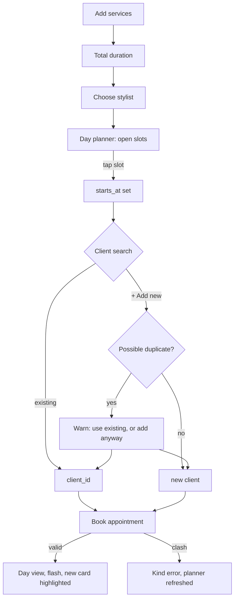

# Booking flow

> Status: search or add a client (with the duplicate warning below), one or several services (picked from `Service.active`), and a moment — tap a day planner slot or type the time directly, both write to the same field (`appointments#new`/`#create`/`#day_planner`/`#client_search`, `resources :appointments, only: [:show, :new, :create]` plus `day_planner` and `client_search` collection routes) — opening as a modal like appointment detail (see below). A clash re-renders the form with `Appointment`'s existing friendly validation message via `shared/_errors` (see [../scheduling/overlap-prevention.md](../scheduling/overlap-prevention.md) for why that message has to be a `:base` error, not `:starts_at`). Not yet built: tapping an open calendar cell to prefill this form (task 3.7). The order below is the agreed target shape; what's built so far is a plain form, not this flow.

## Intent
Follow how the conversation at the desk goes: *"She wants a cut and a gloss, ideally with Melissa, sometime Wednesday."* The front desk and stylists both book, so the flow must be quick on a phone between clients too.

1. **Services**: one or more. Each gets a duration from the service default, adjustable for this visit. The total shows as you go ("90 min").
2. **Stylist**: preselected from the client's preferred stylist when the client is already known.
3. **Moment**: tap an open slot in the day planner ("Find the right moment"), or type a time.
4. **Client**: one search box. Matches appear as you type, and the last option is always *"+ Add "Jane Doe" as a new client"*. See [../clients/summary.md](../clients/summary.md) for the duplicate warning.
5. **Notes** (optional), then **Book appointment** / **Never mind**.



## New appointment is a modal, like appointment detail
Consistent with [../ui/calendar-views.md](../ui/calendar-views.md)'s appointment detail dialog — same `modal` Turbo Frame, same `<dialog data-controller="modal">` (`showModal()` on connect), same centering fix (`m-auto`, since Tailwind's preflight strips the browser default). The day view's "+ New appointment" link carries `data: { turbo_frame: "modal" }` to load `appointments/new` into the frame.

The form itself (`app/views/appointments/_form.html.erb`) needs `data: { turbo_frame: "_top" }` on `form_with` — without it, Turbo scopes the submission response to the `modal` frame it's nested in, which is wrong for *both* outcomes: a successful `create` redirects to `root_path` (the whole calendar should update, not just the frame), and a failed one re-renders `:new` with errors (still a full page render with layout, meant to replace the whole document, not be spliced into the existing frame). "Never mind" needs the same `data: { turbo_frame: "_top" }` on its `link_to`, for the same reason — without it, cancelling would fetch `root_path` and splice only its (empty) `modal` frame back in, rather than doing a real navigation back to the calendar.

## One Stimulus controller for the whole form
`app/javascript/controllers/booking_form_controller.js` covers everything interactive in the form: adding/removing service rows, the running total, prefilling a row's duration, and refreshing the day planner. It started out scoped to just the service rows (`service_lines_controller.js`) and was renamed and extended once the day planner needed to react to the *same* stylist/duration changes — one controller wrapping the whole `<form>` made that coordination trivial (shared targets), rather than two controllers passing state between each other.

```erb
<%# app/views/appointments/_form.html.erb (excerpt) %>
<%= form_with model: appointment, data: { turbo_frame: "_top", controller: "booking-form" } do |form| %>
  <%= form.collection_select :stylist_id, Stylist.active, :id, :name, { prompt: true },
        data: { "booking-form-target": "stylist", action: "change->booking-form#refreshPlanner" } %>

  <div data-booking-form-target="rows">
    <%= form.fields_for :appointment_services do |line| %>
      <%= render "service_line", line: line %>
    <% end %>
  </div>
  <template data-booking-form-target="template">
    <%= form.fields_for :appointment_services, AppointmentService.new, child_index: "NEW_RECORD" do |line| %>
      <%= render "service_line", line: line %>
    <% end %>
  </template>
  <button type="button" data-action="booking-form#add">+ Add a service</button>
  <p>Total: <span data-booking-form-target="total">0 min</span></p>

  <%= turbo_frame_tag "day_planner", src: day_planner_appointments_path(date: date), data: { "booking-form-target": "plannerFrame" } %>

  <%= form.datetime_local_field :starts_at, data: { "booking-form-target": "startsAt" } %>
<% end %>
```

## Services: picked from the catalog, with an adjustable duration
Each service row (`app/views/appointments/_service_line.html.erb`) is a `<select>` of `Service.active` (styled, see [../ui/design-tokens.md](../ui/design-tokens.md)'s `select_chevron`) plus a minutes field. Picking a service prefills minutes from its `default_duration_minutes` (each `<option>` carries a `data-duration`; `booking_form_controller.js#fillDuration` copies it into the row's minutes input on `change`) — still editable, for a visit that runs long or short. `AppointmentsController#service_rows` passes `service_id` and (if present) `duration_minutes` straight through to `accepts_nested_attributes_for`; `position` is computed server-side from row order, not a submitted field, so JS never needs to keep a hidden position input in sync across add/remove.

**Booking does not create services.** An earlier version let typing an unrecognized name create a new `Service` on the spot; that was deliberately reverted. Creating services — and, later, setting their prices — is planned as an admin/power-user function (a Services management page, not yet built; see "Later" in [../plans/roadmap.md](../plans/roadmap.md)'s After MVP list), not something the front desk does implicitly while booking a client.

The last remaining service row can't be removed (`Appointment` requires at least one service regardless, but the UI also blocks it so the total never silently goes empty).

## Day planner ("Find the right moment")
`AppointmentsController#day_planner` (`GET /appointments/day_planner`) computes `Availability.new(stylist:, date:, duration:).open_slots` and renders them as buttons inside a `turbo_frame_tag "day_planner"`. It reloads whenever the stylist select or any service row's minutes changes (`booking_form_controller.js#refreshPlanner`, called from `fillDuration`/`updateTotal`/the stylist select's own `change`), by rewriting the frame's own `src` with the current `stylist_id` and total `minutes` as query params.

Before a stylist is chosen, or with zero total minutes, there's nothing to compute — the frame shows "Choose a stylist and a service to see open times." rather than every active stylist's day (that fallback, so the planner is never an empty box even before narrowing to one stylist, is deferred; not needed for the roadmap's done-when).

Tapping a slot button doesn't submit a hidden field — it directly sets the visible `Time` field's value (`data-planner-value="2026-10-01T09:45"`, exactly the `datetime-local` format, via `booking_form_controller.js#choose`). This is why typing a time and tapping a slot are really the same mechanism from the form's point of view: both just write to `startsAt`, so either one is a complete, valid way to set the moment, matching the "tap a slot, or type a time" intent.

The planner's date comes from the day you were viewing when you opened "+ New appointment" (`new_appointment_path(date: ...)`, defaulting to today), not a separate date picker in the form — see [../ui/calendar-views.md](../ui/calendar-views.md) for the day view side of that link.

**Smooth resize, not a sudden jump.** The frame's content is replaced wholesale on every reload (placeholder text one moment, a grid of slot buttons the next) — a plain CSS `transition` can't animate that, because it only interpolates a property changing on an element that persists, and Turbo replaces the frame's *children*, not the `<turbo-frame>` element itself. That persisting element is exactly what `booking_form_controller.js` animates instead (a FLIP), in two parts:
- `turbo:before-frame-render` (fires *before* the swap, old content still in place) locks the frame's current `offsetHeight` as an explicit inline `height`, with `transition: none` and `overflow: hidden`. This has to happen here, not after the swap — locking after would mean the browser already painted the new (differently-sized) content for a moment before JS clips it back down, which looks like a shrink-then-expand jerk rather than one smooth resize.
- `turbo:frame-render` (fires *after* the swap) briefly releases the lock (`height: auto`) to measure the new content's natural `scrollHeight`, immediately re-locks to the *old* height, forces a layout (reading `offsetHeight`) so the browser registers that starting point, then re-enables the transition and animates to the new height over 200ms, clearing all the inline styles on `transitionend`.

Both handlers no-op on the very first frame load (`plannerInitialized` starts `false`) — there's no prior state to transition from yet, so animating it would just be an unwanted pop the instant the modal opens, with nothing actually having changed.

While a reload is in flight, Turbo sets a `busy` attribute on the `<turbo-frame>` itself; `app/assets/tailwind/application.css` dims it (`opacity: 0.6`, matching the pattern's general spirit of favoring built-in framework hooks over rolling new JS) rather than a spinner, which would mostly flash in and out given how fast a local frame reload is.

```ruby
# app/controllers/appointments_controller.rb (excerpt)
def day_planner
  date = parse_date(params[:date]) || Date.current
  stylist = Stylist.active.find_by(id: params[:stylist_id])
  minutes = params[:minutes].to_i

  @slots = stylist && minutes.positive? ? Availability.new(stylist: stylist, date: date, duration: minutes.minutes).open_slots : []
  @stylist = stylist
  @minutes = minutes

  render layout: false
end
```

## Client search ("Search or add a client")
One text field (`app/views/appointments/_form.html.erb`), not a `<select>` — matches from `Client.matching(q).alphabetical.limit(5)` appear as you type (`AppointmentsController#client_search`, debounced 200ms in `booking_form_controller.js#searchClients`), with "+ Add "\<query\>" as a new client" always the last option. Picking an existing match sets a hidden `client_id`; picking "+ Add..." instead sets a hidden `new_client_name` and clears `client_id` — exactly one of the two is ever non-blank. Typing again (after either choice) clears both, forcing a fresh pick; there is no stale selection lying around behind a changed query.

`AppointmentsController#create` resolves this in the same transaction as the appointment: if no `client_id` was set and `new_client_name` is present (and the duplicate warning below isn't blocking it), it creates that `Client` (with `preferred_stylist` defaulted to the appointment's stylist, per the Rules below) before saving the appointment. If the appointment then fails to save for an unrelated reason (e.g. a time clash), the whole transaction rolls back — no orphan client left behind — and the failed `new_client_name` is threaded back through the redisplayed form so it isn't lost.

```ruby
# app/controllers/appointments_controller.rb (excerpt)
def create
  @appointment = Appointment.new(appointment_attributes)
  @new_client_name = new_client_name

  if @appointment.client.nil? && @new_client_name.present? && !confirm_new_client?
    @duplicates = Client.possible_duplicates_of(name: @new_client_name)
  end

  if @duplicates.present?
    @date = @appointment.starts_at&.to_date || Date.current
    return render :new, status: :unprocessable_entity
  end

  Appointment.transaction do
    if @appointment.client.nil? && @new_client_name.present?
      @appointment.client = Client.create!(name: @new_client_name, preferred_stylist: @appointment.stylist)
    end
    @appointment.save!
  end

  redirect_to root_path(date: @appointment.starts_at.to_date), notice: "Booked. ..."
rescue ActiveRecord::RecordInvalid
  @date = @appointment.starts_at&.to_date || Date.current
  render :new, status: :unprocessable_entity
end
```

See [../clients/summary.md](../clients/summary.md) for the duplicate warning itself (copy, the two buttons, why name-only). One detail specific to *this* form: after any redisplay (the warning above, or a validation error), `booking_form_controller.js#connect` re-checks whether a stylist and services are already chosen and, if so, refreshes the day planner immediately — otherwise it would keep showing its "choose a stylist" placeholder despite both already being filled in, until the next `change` event. This doesn't trigger the height-animation transition, since `plannerInitialized` is still `false` at that point (a fresh page load), same as any other first load.

## Rules
- `ends_at` is derived from `starts_at` plus the total of the services (see [../scheduling/overlap-prevention.md](../scheduling/overlap-prevention.md)).
- A new client's preferred stylist defaults to the appointment's stylist.
- Editing an existing client's contact details happens in Clients, not here.
- Editing an appointment uses the same form with eyebrow "A change of plans".
