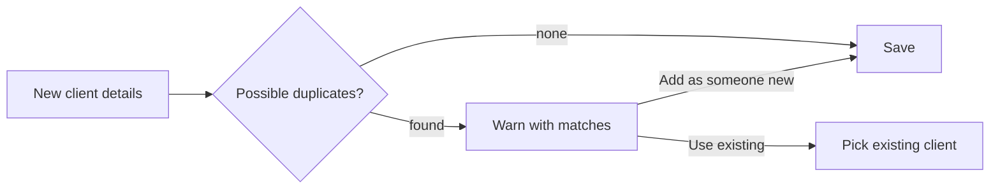

# Clients

> Status: the model below is implemented. Booking (see [../booking/summary.md](../booking/summary.md)) finds an existing client, creates a new one inline, and now shows the duplicate warning below — by name only, since booking never collects phone/email. The Clients page doesn't exist yet, so `possible_duplicates_of`'s email/phone matching has no caller yet either. Pages (index/profile/edit) are still planned.

A client is a person who gets appointments. Keep the record light: a name, optional ways to reach them, and a preferred stylist. No CRM features.

```ruby
# app/models/client.rb
class Client < ApplicationRecord
  belongs_to :preferred_stylist, class_name: "Stylist", optional: true
  has_many :appointments, dependent: :restrict_with_error

  normalizes :email, with: ->(email) { email.strip.downcase }
  normalizes :phone, with: ->(phone) { phone.gsub(/[^\d+]/, "") }

  validates :name, presence: true

  scope :alphabetical, -> { order(:name) }
  scope :matching, ->(q) { where("name LIKE ?", "%#{sanitize_sql_like(q)}%") }

  # Soft check used before creating a client. Never blocks, never merges.
  def self.possible_duplicates_of(name:, email: nil, phone: nil)
    candidate = new(name: name, email: email, phone: phone)   # reuse the normalizers
    scope = where("LOWER(name) = ?", candidate.name.to_s.strip.downcase)
    scope = scope.or(where(email: candidate.email)) if candidate.email.present?
    scope = scope.or(where(phone: candidate.phone)) if candidate.phone.present?
    scope
  end
end
```

## Duplicate warning
When a new client is added (in booking; the Clients page doesn't exist yet) and `possible_duplicates_of` finds matches, `AppointmentsController#create` shows a gentle interruption instead of saving:

> *Looks like Ava Thompson might already be here.* **Use Ava Thompson** · **Add as someone new**

(Booking's version of this always says "might already be here" with no parenthetical reason — it only ever checks by name, since the inline "add a client" flow doesn't collect phone or email. A future page that does collect them could pass those through to `possible_duplicates_of` and be more specific about *why* it matched.)

Both buttons are `type="submit"`, not links: clicking one sets the right hidden field (`client_id` for a match, `confirm_new_client` for "Add as someone new") via `booking_form_controller.js#useDuplicate`/`#confirmNewClient`, then the click's own default behavior submits the form immediately — no separate JS-triggered submit call needed. `AppointmentsController#create` skips the duplicate check entirely when `confirm_new_client` is set, so the second submission goes straight through. Choosing "Add as someone new" saves anyway. Clients are **never merged**. Duplicates are an accepted cost of never blocking the desk.



## Invariants
- A client with appointments is never hard-deleted (`restrict_with_error`).
- The preferred stylist is a suggestion for booking, never a constraint.
- Contact details in the appointment detail are links (`mailto:`, `tel:`).

## Pages (MVP)
- **Index**: eyebrow "The people who come back", headline "Your clients.", with search.
- **Profile**: eyebrow "A familiar face", headline = name. Upcoming and past visits, preferred stylist, contact, **Book again**.
- **Edit**: contact details and preferred stylist.
