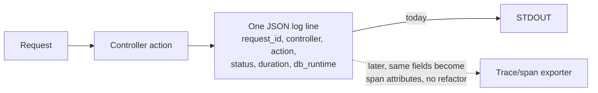

# Deployment and configuration

> Status: structured logging is implemented (task 2.1). Everything else below is already true of the Rails 8 defaults this app was generated with.

We mostly follow [12-factor app](https://12factor.net) principles, with one deliberate deviation on logging.

## Where we agree with 12-factor
- **Containers.** `Dockerfile` (multi-stage, production-oriented) and `config/deploy.yml` (Kamal) ship with the app from `rails new`. Build: `docker build -t chairflow .`
- **Config via environment variables**, for things that vary by deploy: `RAILS_MAX_THREADS` (`config/database.yml`), `RAILS_LOG_LEVEL` and `RAILS_MASTER_KEY` (`config/environments/production.rb`, `Dockerfile`). New config that varies per environment (API keys, external service URLs, feature flags) follows this pattern: `ENV.fetch("THING") { default }`, never hardcoded.
- **Reasonable defaults.** Rails omakase itself: SQLite, Solid Queue/Cache/Cable, Puma, Kamal — see [../practices.md](../practices.md)'s stack table. We don't swap these out without a reason recorded here.

## Where we don't (yet) fully agree
- **Secrets.** Rails' encrypted `config/credentials.yml.enc` (decrypted via `config/master.key`, itself from `RAILS_MASTER_KEY`) is kept for now rather than moving every secret to a raw env var — there's exactly one salon and no secrets yet. Revisit if/when there's more than a couple of credentials to manage, or a second deploy target.

## Logging: structured from the start, not stdout noise
12-factor's logging factor says "treat logs as event streams" and just write unstructured lines to stdout, letting the execution environment collect them. We agree with shipping to stdout (no log files, no in-app log routing), but **disagree that unstructured text is enough.** Rails 8's own production default was exactly that (`ActiveSupport::TaggedLogging.logger(STDOUT)` with a `[request_id]` text prefix on every line) — multi-line, free-text output per request (one line per SQL query, one per render, one per redirect...). It's noise: hard to query, hard to correlate, and every line would need re-touching later to add trace/span IDs.

**What we did instead:** one structured (JSON) line per request, in every environment (not just production), via `lograge`. Chosen over hand-rolling a formatter (more code to maintain) or a heavier framework (`rails_semantic_logger` and friends) this single-salon app doesn't need yet.

```ruby
# config/initializers/lograge.rb
Rails.application.configure do
  config.lograge.enabled = true
  config.lograge.formatter = Lograge::Formatters::Json.new

  # request_id as a JSON field, not a TaggedLogging text prefix (which would break the JSON).
  config.lograge.custom_options = lambda do |event|
    { request_id: event.payload[:headers]["action_dispatch.request_id"] }
  end
end
```
`ActiveSupport::TaggedLogging` and `lograge`'s JSON formatter don't mix: tags are a plain-text prefix (`[request_id] {...}`), which breaks the line as JSON. So `config/environments/production.rb` was changed from tagged logging to a plain `ActiveSupport::Logger.new(STDOUT)`, and `request_id` is carried as a JSON field via `custom_options` instead (pulled from `event.payload[:headers]["action_dispatch.request_id"]`, which `ActionController::Instrumentation` always includes).

Verified by request (`curl localhost:PORT/up`, development env) — one line:
```json
{"method":"GET","path":"/up","format":"*/*","controller":"Rails::HealthController","action":"show","status":200,"allocations":2298,"duration":1.84,"view":0.79,"db":0.0,"request_id":"e74310ac-..."}
```



Rails' framework-internal chatter (SQL queries, view rendering, asset lookups) is not disabled, just no longer the primary signal — lograge's one line per request is.

## Later
- OpenTelemetry (traces/spans) once there's something worth tracing across — a second service, a slow endpoint, a real production deploy. The structured-logging fields above are chosen so that move doesn't require re-touching call sites.
- Kamal deploy secrets (`.kamal/secrets`) currently reference `config/master.key`; revisit alongside the credentials-vs-env-vars question above if a second environment (staging) is added.
