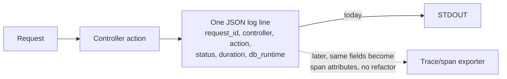

# Deployment and configuration

> Status: principles agreed; structured logging is not yet implemented (see task 2.1 in [../plans/roadmap.md](../plans/roadmap.md)). Everything else below is already true of the Rails 8 defaults this app was generated with.

We mostly follow [12-factor app](https://12factor.net) principles, with one deliberate deviation on logging.

## Where we agree with 12-factor
- **Containers.** `Dockerfile` (multi-stage, production-oriented) and `config/deploy.yml` (Kamal) ship with the app from `rails new`. Build: `docker build -t chairflow .`
- **Config via environment variables**, for things that vary by deploy: `RAILS_MAX_THREADS` (`config/database.yml`), `RAILS_LOG_LEVEL` and `RAILS_MASTER_KEY` (`config/environments/production.rb`, `Dockerfile`). New config that varies per environment (API keys, external service URLs, feature flags) follows this pattern: `ENV.fetch("THING") { default }`, never hardcoded.
- **Reasonable defaults.** Rails omakase itself: SQLite, Solid Queue/Cache/Cable, Puma, Kamal — see [../practices.md](../practices.md)'s stack table. We don't swap these out without a reason recorded here.

## Where we don't (yet) fully agree
- **Secrets.** Rails' encrypted `config/credentials.yml.enc` (decrypted via `config/master.key`, itself from `RAILS_MASTER_KEY`) is kept for now rather than moving every secret to a raw env var — there's exactly one salon and no secrets yet. Revisit if/when there's more than a couple of credentials to manage, or a second deploy target.

## Logging: structured from the start, not stdout noise
12-factor's logging factor says "treat logs as event streams" and just write unstructured lines to stdout, letting the execution environment collect them. We agree with shipping to stdout (no log files, no in-app log routing), but **disagree that unstructured text is enough.** Rails 8's own production default is exactly that:

```ruby
# config/environments/production.rb (Rails 8 default, current state)
config.log_tags = [ :request_id ]
config.logger   = ActiveSupport::TaggedLogging.logger(STDOUT)
```
This produces multi-line, free-text log output per request (one line per SQL query, one per render, one per redirect...). It's noise: hard to query, hard to correlate, and every line would need re-touching later to add trace/span IDs.

**Decision:** log one structured (JSON) line per request from day one, with fields that map cleanly onto a future trace's span attributes (`request_id`, `controller`, `action`, `status`, `duration`, `db_runtime`, `view_runtime`). The concrete mechanism (task 2.1): the `lograge` gem, condensing each request into a single `Lograge::Formatters::Json` line. This is chosen over hand-rolling a formatter (more code to maintain ourselves) or a heavier logging framework (`rails_semantic_logger` and friends) that this single-salon app doesn't need yet.

```ruby
# config/environments/production.rb (planned, task 2.1)
config.lograge.enabled = true
config.lograge.formatter = Lograge::Formatters::Json.new
```



Rails' framework-internal chatter (SQL queries, view rendering, asset lookups) is not disabled, just no longer the primary signal — lograge's one line per request is. Verify in development too (where readable logs matter for debugging); a per-environment call on whether development keeps lograge or the default formatter is part of task 2.1.

## Later
- OpenTelemetry (traces/spans) once there's something worth tracing across — a second service, a slow endpoint, a real production deploy. The structured-logging fields above are chosen so that move doesn't require re-touching call sites.
- Kamal deploy secrets (`.kamal/secrets`) currently reference `config/master.key`; revisit alongside the credentials-vs-env-vars question above if a second environment (staging) is added.
