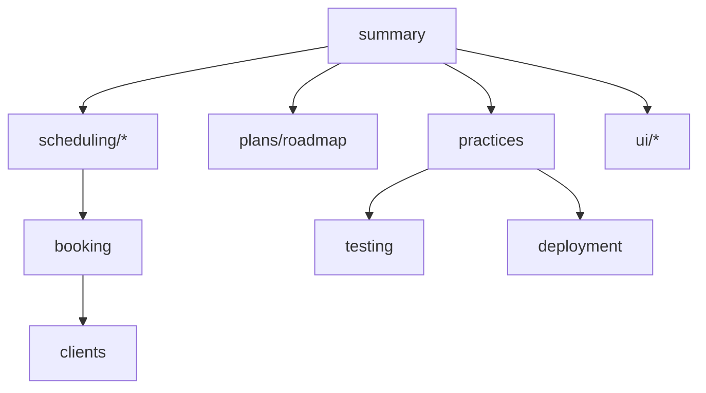

# Lode map

Read this first. Every lode file is listed with one line on what it covers.

```
lode/
├── summary.md                     What chairflow is, MVP scope, status
├── terminology.md                 Domain words; code term vs. UI phrasing
├── practices.md                   Principles, task loop, commits, stack, conventions
├── lode-map.md                    This index
├── plans/
│   ├── roadmap.md                 MVP tasks with "Done when" tests; after-MVP list
│   └── open-questions.md          Decisions still needed (MVP vs. parked)
├── scheduling/
│   ├── summary.md                 MVP rules and schema (multi-service appointments)
│   ├── salon-hours.md             SalonDay model and page; the only bookable window in the MVP
│   ├── availability.md            Open-slot computation
│   ├── overlap-prevention.md      No double-booking; derived ends_at; IMMEDIATE transactions
│   └── time-zones.md              UTC storage, wall clock, DST test dates
├── booking/
│   └── summary.md                 Booking order, service rows, day planner, inline client add
├── clients/
│   └── summary.md                 Client model, duplicate warning (never merge), pages
├── deployment/
│   └── summary.md                 12-factor stance, containers/config/secrets, structured logging
├── ui/
│   ├── summary.md                 Visual direction, MVP page map, layout skeleton
│   ├── voice-and-copy.md          Heading pattern, tone rules, page copy
│   ├── design-tokens.md           Tailwind v4 theme, swatches, system font, shapes
│   └── calendar-views.md          Day view, appointment detail, live refresh
├── testing/
│   └── summary.md                 Testing trophy, Playwright system tests, when to unit test
└── tmp/                           Git-ignored session scraps and handovers
```


