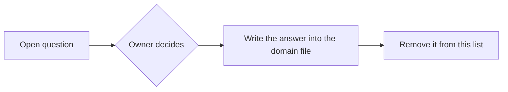

# Open questions

Decisions still needed. Once a question is answered, move the answer into the relevant domain file and delete it here.

## Needed during the MVP
None right now.

## Parked until after the MVP
1. **Sign-in and roles.** Front desk and stylists both book, and stylists fill in at the desk. Do stylists get their own logins? Does anyone see only their own day? Needs a proper conversation.
2. **Scheduling redesign.** Per-stylist hours, breaks, and time off, plus how out-of-hours bookings warn (probably a warning, not a block).
3. **Processing time.** The salon does this in practice; model it once scheduling is redesigned.
4. **Reminders.** Channel and timing.
5. **Who may change salon hours** once there are sign-ins.

