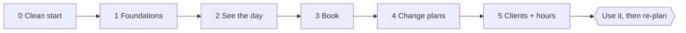

# Roadmap

MVP = the normal business flows: **see the day, book, edit/reschedule, cancel, find and add clients, set salon hours.** Tasks are small, each ends in at least one commit, and each has a **Done when** test. Tick a box only when the commit is on `main`. Describe the resulting system in the domain files, not here. See [../practices.md](../practices.md) for the task loop.

## Phase 0: Clean start
- [x] **0.1 Archive the POC.** `git branch archive/poc-v1 && git tag poc-v1 && git push origin archive/poc-v1 --tags`. *Done when:* branch and tag exist on the remote.
- [x] **0.2 New Rails app on a clean main.** Remove the old code; `rails new . --css=tailwind`. *Done when:* `bin/dev` serves the Rails welcome page.
- [x] **0.3 Add the lode.** Commit `lode/` and ignore `lode/tmp/`. *Done when:* `lode/` is committed and `git status` is clean after writing to `lode/tmp/`.
- [x] **0.4 Time zone and SQLite transactions.** Set `America/New_York`; confirm `IMMEDIATE` transactions. *Done when:* a one-line test asserts `Time.zone.name`, and the transaction mode is recorded in the lode.
- [x] **0.5 Browser tests and CI.** Capybara + Playwright, one smoke system test, CI runs everything. *Done when:* CI is green, including the smoke test.

## Phase 1: Foundations
- [x] **1.1 Stylists and services.** Models, fixtures, seeds (no admin pages). *Done when:* `bin/rails db:seed` loads them and a model test covers `active` scopes.
- [x] **1.2 Clients.** Model, normalizers, `matching`, `possible_duplicates_of`. *Done when:* unit tests cover normalization and duplicate matching.
- [x] **1.3 Appointments with services.** `Appointment` + `AppointmentService`, derived `ends_at`, statuses. *Done when:* unit tests cover `ends_at` from one and from several services.
- [x] **1.4 No double-booking.** Overlap validation. *Done when:* unit tests cover back-to-back, cancelled, and self-edit cases.
- [x] **1.5 Salon days.** `SalonDay` model and seeds (every day, 8 AM to 6 PM). *Done when:* unit tests cover validations and the DST dates.
- [x] **1.6 Availability.** `Availability` within salon hours. *Done when:* unit tests cover the edge cases in [../scheduling/availability.md](../scheduling/availability.md).

## Phase 2: Seeing the day
- [x] **2.1 Structured logging baseline.** `lograge` with a JSON formatter, before the first real controller exists. *Done when:* a request in the dev/test log emits one JSON line (not Rails' default multi-line text), recorded in [../deployment/summary.md](../deployment/summary.md).
- [x] **2.2 Layout and look.** Tokens, nav, page header partial, flash. *Done when:* a system test visits `/` and sees "The appointment book."
- [x] **2.3 Day view.** Stylist columns with appointment cards placed by time. *Done when:* a system test sees a fixture appointment under the right stylist.
- [x] **2.4 Moving between days.** Arrows, Today, count, closed-day message. *Done when:* a system test steps to tomorrow and back.
- [x] **2.5 Appointment detail.** Dialog in the modal frame. *Done when:* a system test opens a card and sees the client, services, and time.

## Phase 3: Booking
- [x] **3.1 Book the simplest case.** Existing client, one service, typed time. *Done when:* a system test books and sees the card on the day view.
- [x] **3.2 Several services.** Add and remove service rows; the total updates. *Done when:* a system test books two services and sees the combined end time.
- [x] **3.3 Day planner.** Open slots in a frame; tap to choose. *Done when:* a system test books by tapping a slot.
- [x] **3.4 Find or add a client.** One search box with "+ Add … as a new client". *Done when:* a system test books a brand-new client.
- [ ] **3.5 Duplicate warning.** *Done when:* a system test sees the warning for a matching phone, then both "Use existing" and "Add as someone new" work.
- [ ] **3.6 Kind clash errors.** *Done when:* a system test attempts a clash and reads the friendly message.
- [ ] **3.7 Book from the calendar.** Tap an open cell to prefill stylist and time. *Done when:* a system test does it. Revisit here: a subtle hourly tick line (cross-column time alignment, not a dense labeled grid — see [../ui/calendar-views.md](../ui/calendar-views.md)) and a current-time indicator ([../ui/calendar-views.md](../ui/calendar-views.md)'s "Later"), both about giving the empty grid space meaning, same as this task.

## Phase 4: Changing plans
- [ ] **4.1 Edit and reschedule.** *Done when:* a system test moves an appointment and sees it at the new time.
- [ ] **4.2 Cancel.** Soft cancel with a confirmation. *Done when:* a system test cancels, the card disappears, and the slot is bookable.
- [ ] **4.3 Book again.** From the detail dialog and the client profile. *Done when:* a system test sees the form prefilled.
- [ ] **4.4 Live refresh.** *Done when:* a two-session system test sees a booking appear without reloading.

## Phase 5: Clients and salon hours
- [ ] **5.1 Clients index with search.** *Done when:* a system test finds a client by partial name.
- [ ] **5.2 Client profile.** Upcoming and past visits. *Done when:* a system test sees both.
- [ ] **5.3 Edit a client.** Contact details and preferred stylist, with the duplicate warning. *Done when:* a system test edits a phone number.
- [ ] **5.4 Salon hours page.** Seven days, closed toggle, 15-minute time selects. *Done when:* a system test closes Mondays and the day view shows the closed message; another moves opening to 9:00 and the 8:00 slots disappear from the planner.

**MVP complete here.** Pause, use it, then re-plan.

## After MVP (not scheduled, not in scope)
- Revisit scheduling from scratch: per-stylist hours, breaks, time off and holidays, warnings for out-of-hours times.
- Processing time (a stylist is free during color development). The family salon does this; parked on purpose.
- Sign-in and roles: front desk and stylists both book (needs a design conversation).
- Week view; Team schedule page.
- Services management page: create/edit services and (eventually) prices. Gated to an admin/power-user role, not the front desk — depends on the sign-in/roles design above. Booking (Phase 3) only ever picks from `Service.active`; it deliberately doesn't create services.
- Reminders (email or SMS); deploy with Kamal.
