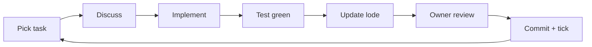

# Practices

## Product principles
- **Minimal, elegant, welcoming.** If a feature makes the app feel like an ERP, it waits or goes away.
- **MVP first.** Normal business flows only (see [summary.md](summary.md)). New ideas go to "After MVP" in [plans/roadmap.md](plans/roadmap.md), not into the current task.
- **The front desk lives in today.** Optimize for "who's in now and when's the next opening".
- **Voice is a feature.** See [ui/voice-and-copy.md](ui/voice-and-copy.md).
- **Warn, don't block,** where a person may know better (duplicates, and later overrides). Block only what would corrupt the book (double-booking).

## Working in small steps
Work is broken into **tasks** in [plans/roadmap.md](plans/roadmap.md). A task is the smallest change that leaves the app working and delivers something visible or enforces a rule, usually under half a day.

Each task states:
- **Done when**: an observable outcome, usually a passing system test.
- **Lode**: the files it touches.

The loop for every task:
1. Pick the next unchecked task. Discuss it briefly, then agree on the approach.
2. Implement, then write or extend its test.
3. Run `bin/rails test:all` (includes system tests) and `bin/rubocop`, both green.
4. Update the lode in the **same commit** so it matches the code.
5. The owner reviews. On "looks good", commit and tick the task.



### Commits
- Commit whenever a complete change is ready. Several commits per task is fine; a broken `main` is not.
- Subject in the imperative, 50 characters or fewer; the body says **why**.
- Never mix unrelated changes. A drive-by fix gets its own commit.

```text
Add overlap validation to appointments

Two booked appointments for one stylist must never overlap. SQLite has
no exclusion constraints, so the model enforces it inside an IMMEDIATE
transaction. Back-to-back appointments are allowed (half-open ranges).
```

## Stack (Rails omakase)
| Concern | Choice |
|---|---|
| Framework | Rails 8, Ruby 3.4+ |
| Database | SQLite (plus Solid Queue, Cache, and Cable) |
| Front end | Hotwire: Turbo Drive, Frames, morphing refreshes, Stimulus |
| Styling | Tailwind v4 via `tailwindcss-rails` |
| JS delivery | importmap; no Node build step |
| Tests | Minitest + fixtures; Capybara system tests on Playwright |
| Lint / security | `rubocop-rails-omakase`, Brakeman |
| Later | Rails 8 authentication, Action Mailer reminders, Kamal |

## Code conventions
- Business rules live in models and small POROs under `app/models` (e.g. `Availability`). No `app/services` grab-bag.
- Controllers stay RESTful. New behavior gets a new resource, not a custom action.
- Times are stored in UTC and shown in the salon zone. See [scheduling/time-zones.md](scheduling/time-zones.md).
- Tailwind class names must appear in full in source. Never build them by string interpolation.
- Reach for Turbo first; Stimulus controllers stay small and single-purpose.
- Add a gem only when it removes real work, and record why here.

## Hotwire patterns
- Appointment detail opens in a `<dialog>` inside the `modal` Turbo Frame.
- The day planner is a Turbo Frame reloaded when the services, stylist, or date change.
- Calendars subscribe to one `"calendar"` stream; appointment commits broadcast a refresh and pages morph.

## Git
- `main` is the source of truth. The POC on `archive/poc-v1` is a clean break and not referenced.
- `lode/tmp/` is git-ignored:

```gitignore
/lode/tmp/*
!/lode/tmp/.keep
```
