# Availability (open slots)

> Status: implemented (task 1.6), as a plain PORO (`app/models/availability.rb`), not an `ActiveRecord::Base`. Used by nothing yet — the day planner that calls it is still planned (task 3.3).

`Availability` answers: *for this stylist, on this date, for this long, which start times are open?* It feeds the day planner.

## Contract
- Input: `stylist`, `date` (a `Date` in the salon zone), `duration` (an `ActiveSupport::Duration`, the total of the chosen services).
- Output: an ordered array of `ActiveSupport::TimeWithZone` start times.
- A start is open when `[start, start + duration)` fits inside salon hours and overlaps none of the stylist's **booked** appointments.
- A closed day returns `[]`; the UI says so kindly ("We're closed Mondays. Try Tuesday?").

```ruby
# app/models/availability.rb
class Availability
  SLOT = 15.minutes

  def initialize(stylist:, date:, duration:)
    @stylist, @date, @duration = stylist, date, duration
  end

  def open_slots
    window = SalonDay.hours_on(@date) or return []
    busy = @stylist.appointments.booked.on(@date).map { |a| a.starts_at...a.ends_at }

    starts_within(window).reject do |start|
      busy.any? { |range| overlaps?(start...(start + @duration), range) }
    end
  end

  private

  def starts_within(window)
    Enumerator.produce(window.begin) { |t| t + SLOT }
              .take_while { |t| t + @duration <= window.end }
  end

  def overlaps?(a, b)
    a.begin < b.end && b.begin < a.end
  end
end
```
(Regular `def...end`, not endless methods, to match this project's rubocop-rails-omakase style.)

```ruby
# app/models/appointment.rb (excerpt, alongside :overlapping from overlap-prevention.md)
scope :on, ->(date) { where(starts_at: date.in_time_zone.all_day) }
```



```mermaid
gantt
  dateFormat HH:mm
  axisFormat %H:%M
  section Melissa, Wed
  Salon hours      :08:00, 10h
  Open 8-9         :active, 08:00, 1h
  Ava (Highlights) :crit, 09:00, 3h
  Open from 12:00  :active, 12:00, 6h
```

## Edge cases (unit-tested in `test/models/availability_test.rb`)
- A closed day returns `[]`.
- A duration longer than any gap returns `[]`.
- A slot ending exactly at closing time is open.
- A slot starting exactly when an appointment ends is open.
- Cancelled appointments don't block.
- 45-minute totals land on the 15-minute grid.
