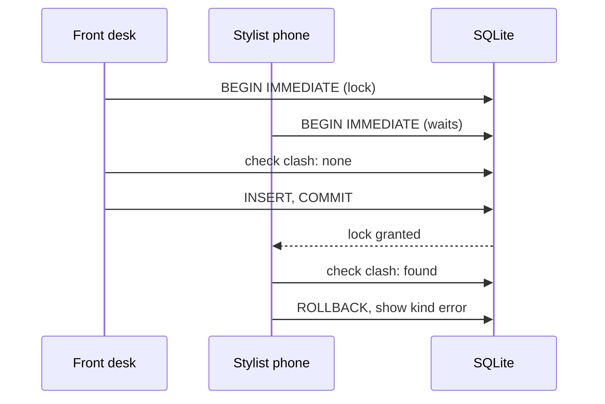

# Overlap prevention (no double-booking)

> Status: implemented, on top of the `Appointment` model from [summary.md](summary.md).

## The rule
Two `booked` appointments for the same stylist must never overlap. Intervals are half-open, so one ending at 10:00 and another starting at 10:00 is fine. This is the one scheduling rule that **blocks** rather than warns, because a double-booking corrupts the book.

Outside salon hours is **not** blocked by validation. It only affects which slots are offered. Whether to warn for manual out-of-hours times is decided when scheduling is revisited after the MVP.

## Why this needs care
SQLite has no exclusion constraints, so the model enforces the rule. It must be safe when two people book at once (for example, the front desk and a stylist on their phone).

## How we enforce it
1. A model validation checks for a clash.
2. `save` runs validations inside its transaction.
3. Rails 8's SQLite adapter starts transactions as `IMMEDIATE`, which takes the write lock at `BEGIN`, so a second writer waits and then sees the first appointment. `SQLite3Adapter` hardcodes `default_transaction_mode: :immediate` unconditionally in its connection parameters (`activerecord-8.1.4/lib/active_record/connection_adapters/sqlite3_adapter.rb`) — there is no `config/database.yml` setting that changes or overrides this.

```ruby
# app/models/appointment.rb (excerpt; full model in scheduling/summary.md)
scope :overlapping, ->(from, to) { where("starts_at < ? AND ends_at > ?", to, from) }

validate :stylist_is_free, if: -> { booked? && stylist && starts_at && ends_at }

private

def stylist_is_free
  clash = stylist.appointments.booked.overlapping(starts_at, ends_at).where.not(id: id).first
  return unless clash

  errors.add(:base,
    "#{stylist.name} is with #{clash.client.name} until #{clash.ends_at.strftime('%-l:%M %p')}.")
end
```
`where.not(id: id)` is `nil`-safe: for an unsaved appointment it becomes `WHERE id IS NOT NULL`, which excludes nothing (there is no self-row yet).

**The error goes on `:base`, not `:starts_at`.** Rails' `full_messages` (what `shared/_errors` renders) prefixes a field error with that field's humanized name — `errors.add(:starts_at, "Melissa is with...")` becomes "Starts at Melissa is with Ava Thompson until 9:45 AM.", which reads as broken English despite the message itself being exactly the friendly sentence intended. `:base` is the one attribute Rails' `full_message` never prefixes, which is also why `has_a_service` above uses it for "Choose at least one service."



## Tests (unit, justified by ambiguity)
- Back-to-back appointments are allowed.
- Cancelled appointments don't block.
- Editing an appointment doesn't clash with itself.
- Removing a service shortens `ends_at` and can free a clash.
