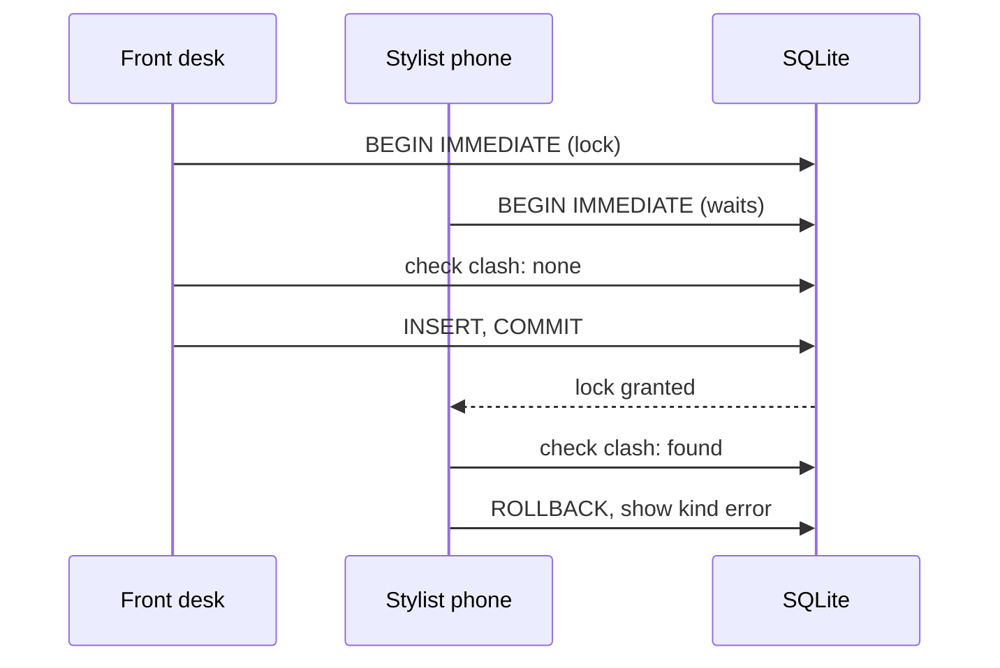

# Overlap prevention (no double-booking)

> Status: planned, not yet implemented.

## The rule
Two `booked` appointments for the same stylist must never overlap. Intervals are half-open, so one ending at 10:00 and another starting at 10:00 is fine. This is the one scheduling rule that **blocks** rather than warns, because a double-booking corrupts the book.

Outside salon hours is **not** blocked by validation. It only affects which slots are offered. Whether to warn for manual out-of-hours times is decided when scheduling is revisited after the MVP.

## Why this needs care
SQLite has no exclusion constraints, so the model enforces the rule. It must be safe when two people book at once (for example, the front desk and a stylist on their phone).

## How we enforce it
1. A model validation checks for a clash.
2. `save` runs validations inside its transaction.
3. Rails 8's SQLite adapter starts transactions as `IMMEDIATE`, which takes the write lock at `BEGIN`, so a second writer waits and then sees the first appointment. **Verify this during scaffolding**; set `default_transaction_mode: immediate` in `config/database.yml` if needed.

```ruby
# app/models/appointment.rb (excerpt)
class Appointment < ApplicationRecord
  belongs_to :client
  belongs_to :stylist
  has_many :appointment_services, -> { order(:position) }, dependent: :destroy, inverse_of: :appointment
  has_many :services, through: :appointment_services
  accepts_nested_attributes_for :appointment_services, allow_destroy: true

  enum :status, { booked: "booked", cancelled: "cancelled" }, default: :booked

  scope :overlapping, ->(from, to) { where("starts_at < ? AND ends_at > ?", to, from) }

  before_validation :derive_ends_at
  validates :starts_at, presence: true
  validate :has_a_service
  validate :stylist_is_free, if: -> { booked? && stylist && starts_at && ends_at }

  def duration
    appointment_services.reject(&:marked_for_destruction?).sum(&:duration_minutes).minutes
  end

  private

  def derive_ends_at
    self.ends_at = starts_at + duration if starts_at
  end

  def has_a_service
    errors.add(:base, "Choose at least one service.") if duration.zero?
  end

  def stylist_is_free
    clash = stylist.appointments.booked.overlapping(starts_at, ends_at).where.not(id: id).first
    return unless clash

    errors.add(:starts_at,
      "#{stylist.name} is with #{clash.client.name} until #{clash.ends_at.strftime('%-l:%M %p')}.")
  end
end
```



## Tests (unit, justified by ambiguity)
- Back-to-back appointments are allowed.
- Cancelled appointments don't block.
- Editing an appointment doesn't clash with itself.
- Removing a service shortens `ends_at` and can free a clash.
