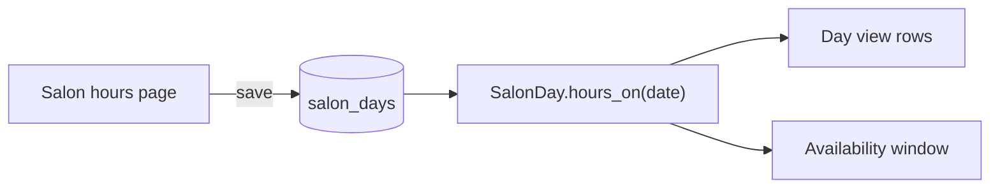

# Salon hours

> Status: `SalonDay` is implemented and seeded (task 1.5, all seven days open 8-6). The Salon hours page (controller/view below) is still planned (task 5.4).

The salon sets its own opening hours on the **Salon hours** page. In the MVP, these hours are the single bookable window for every stylist. Defaults: **every day, 8:00 AM to 6:00 PM** Eastern, until the salon changes them.

## Model
One `SalonDay` row per weekday. Times are **minutes after local midnight**, so 8:00 stays 8:00 in both EST and EDT.

```ruby
# db/migrate/xxx_create_salon_days.rb
create_table :salon_days do |t|
  t.integer :wday,          null: false                 # 0 = Sunday, matches Date#wday
  t.boolean :closed,        null: false, default: false
  t.integer :opens_minute,  null: false, default: 480   # 8:00 AM
  t.integer :closes_minute, null: false, default: 1080  # 6:00 PM
  t.timestamps
end
add_index :salon_days, :wday, unique: true
```

We use integer minutes, not a SQL `time` column. Rails treats `time` columns as time-zone aware and anchors them to Jan 1, 2000, which shifts values by an hour around DST. The times are also kept when a day is marked closed, so reopening it restores them.

```ruby
# app/models/salon_day.rb
class SalonDay < ApplicationRecord
  STEP = 15

  validates :wday, inclusion: { in: 0..6 }, uniqueness: true
  validates :opens_minute, :closes_minute, inclusion: { in: 0..(24 * 60 - STEP) }
  validate :closes_after_opens, :on_the_slot_grid

  def self.hours_on(date)
    day = find_by(wday: date.wday)
    day.range_on(date) unless day.nil? || day.closed?
  end

  def self.week_from_monday
    all.sort_by { |day| (day.wday - 1) % 7 }
  end

  def range_on(date)
    wall_clock(date, opens_minute)...wall_clock(date, closes_minute)
  end

  private

  # Sets the local wall clock; never add minutes to midnight (wrong on DST days).
  def wall_clock(date, minute)
    date.in_time_zone.change(hour: minute / 60, min: minute % 60)
  end

  def closes_after_opens
    errors.add(:closes_minute, "needs to be after opening") if closes_minute && opens_minute && closes_minute <= opens_minute
  end

  def on_the_slot_grid
    return if [ opens_minute, closes_minute ].compact.all? { |m| (m % STEP).zero? }

    errors.add(:base, "Times need to be on the quarter hour")
  end
end
```
(Written as regular `def...end` rather than endless methods, and with nil-guards in the two custom validations, to match this project's rubocop-rails-omakase style.)

```ruby
# db/seeds.rb (excerpt): all seven days, 8 to 6
(0..6).each do |wday|
  SalonDay.find_or_create_by!(wday: wday) { |day| day.opens_minute = 480; day.closes_minute = 1080 }
end
```

A missing row counts as closed, so `hours_on` returns `nil`, just as for a closed day.

## Invariants
- Changing hours **never** changes or cancels existing appointments. The day view expands to show any appointment that falls outside the new hours.
- Hours only limit which open slots are **offered**; they don't block validation (see [overlap-prevention.md](overlap-prevention.md)).

## Salon hours page
A singular resource: `resource :salon_hours, only: %i[edit update]`. It shows seven rows, Monday first. Each row has the day name, a **Closed** toggle, and opening and closing time selects in 15-minute steps. There is one **Save hours** button, and all seven rows save in a single transaction.

```ruby
# app/controllers/salon_hours_controller.rb (sketch; confirm params.expect shape when building)
def update
  rows = params.expect(salon_days: [[:id, :closed, :opens_minute, :closes_minute]])
  SalonDay.transaction do
    rows.each { |row| SalonDay.find(row[:id]).update!(row.except(:id)) }
  end
  redirect_to edit_salon_hours_path, notice: "Saved. The calendar will follow your new hours."
rescue ActiveRecord::RecordInvalid
  @days = SalonDay.week_from_monday
  render :edit, status: :unprocessable_entity
end
```

Copy: eyebrow "When the doors are open", headline "Salon hours.", subline "Set them once. Change them whenever life does."



## Later
- Per-stylist hours and breaks will sit *inside* salon hours when scheduling is redesigned.
- Holidays and one-off closures (not the weekly pattern) come with time off.
- Once there are sign-ins, only some roles may change hours. Until then, anyone using the app can.
