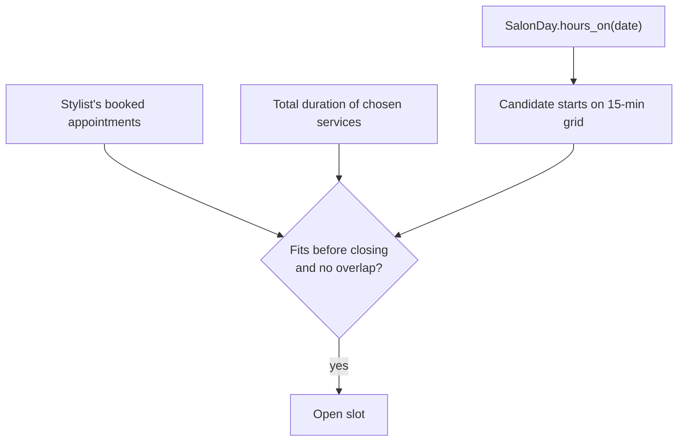

# Scheduling

> Status: `Stylist`, `Service`, `Appointment`, and `AppointmentService` are implemented (tasks 1.1, 1.3), including derived `ends_at` and the `booked`/`cancelled` status. Overlap prevention (1.4), salon days (1.5), and availability (1.6) are still planned. **Deliberately simple for the MVP.** Per-stylist availability (working hours, breaks, time off, processing time) will be redesigned from scratch after the MVP. The POC's approach is not being reused.

## MVP rules
1. **Salon hours**, set by the salon on the Salon hours page (default 8 AM to 6 PM every day), are the only bookable window, the same for every stylist. See [salon-hours.md](salon-hours.md).
2. A booked appointment never overlaps another booked appointment for the same stylist. See [overlap-prevention.md](overlap-prevention.md).
3. Intervals are half-open, `[starts_at, ends_at)`, so back-to-back appointments are allowed.
4. Open slots start on the 15-minute grid in local wall-clock time.

## Schema
All four tables below are implemented (`app/models/stylist.rb`, `service.rb`, `appointment.rb`, `appointment_service.rb`). `Stylist::SWATCHES` is the canonical swatch list (`lavender`, `sage`, `clay`, `sky`, `sand`; see [../ui/design-tokens.md](../ui/design-tokens.md)). `Stylist` and `Service` each have an `active` scope; `Stylist`/`Service` are seeded via `db/seeds.rb`.
```ruby
create_table :stylists do |t|
  t.string  :name,   null: false
  t.string  :swatch, null: false          # see ui/design-tokens.md
  t.boolean :active, null: false, default: true
  t.timestamps
end

create_table :services do |t|
  t.string  :name,                     null: false
  t.integer :default_duration_minutes, null: false
  t.boolean :active, null: false, default: true
  t.timestamps
end

create_table :appointments do |t|
  t.references :client,  null: false, foreign_key: true
  t.references :stylist, null: false, foreign_key: true
  t.datetime :starts_at, null: false       # UTC
  t.datetime :ends_at,   null: false       # UTC; starts_at + total duration
  t.string   :status,    null: false, default: "booked"   # booked | cancelled
  t.text     :notes
  t.timestamps
end
add_index :appointments, [:stylist_id, :starts_at]

create_table :appointment_services do |t|
  t.references :appointment, null: false, foreign_key: true
  t.references :service,     null: false, foreign_key: true
  t.integer :position,         null: false
  t.integer :duration_minutes, null: false
end
```

`ends_at` is stored so overlap queries stay simple and indexable. `Appointment#derive_ends_at` (a `before_validation`) sets it to `starts_at + duration`, where `duration` sums the (non-destroyed) `appointment_services`' `duration_minutes`; it is never typed by hand. An appointment with no services is invalid (`has_a_service`, error on `:base`). `AppointmentService#duration_minutes` defaults from `service.default_duration_minutes` when left blank, and can be overridden per visit. `Appointment.status` is an enum (`booked` default, `cancelled`); overlap prevention for `booked` appointments is [overlap-prevention.md](overlap-prevention.md), not yet implemented.



## Files
- [salon-hours.md](salon-hours.md) - `SalonDay` model, the Salon hours page, wall-clock handling
- [availability.md](availability.md) - computing open slots
- [overlap-prevention.md](overlap-prevention.md) - no double-booking, including races
- [time-zones.md](time-zones.md) - UTC storage and DST
