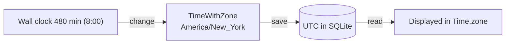

# Time zones and DST

> Status: planned, not yet implemented.

## Rules
- The salon zone is `America/New_York`: `config.time_zone = "America/New_York"`.
- Every `datetime` column is stored in UTC (Rails default). Display always uses `Time.zone`.
- Salon hours are **wall-clock minutes** (480 = 8:00), turned into times with `change`, never by adding minutes to midnight. "8 to 6 Eastern" means 8 to 6 local time in both EST and EDT. See [salon-hours.md](salon-hours.md).
- Form input from `datetime-local` is parsed in the salon zone with `Time.zone.parse`.

```ruby
# Wrong on DST days: midnight + 8 hours can land at 7:00 or 9:00
date.in_time_zone + 8.hours
# Right: set the wall clock
date.in_time_zone.change(hour: 8)
```



## Dates worth a test
- **Sun, Nov 1, 2026**: clocks fall back.
- **Sun, Mar 14, 2027**: clocks spring forward.

One unit test per date asserting that `SalonDay#range_on` starts at 08:00 locally is enough.

```ruby
test "8:00 stays 8:00 across fall back" do
  day = SalonDay.new(wday: 0, opens_minute: 480, closes_minute: 1080)
  assert_equal "08:00", day.range_on(Date.new(2026, 11, 1)).begin.strftime("%H:%M")
end
```

## Lesson
Tests that depend on "now" use `travel_to`. System tests run the app server in the same process, so `travel_to` applies there too.
