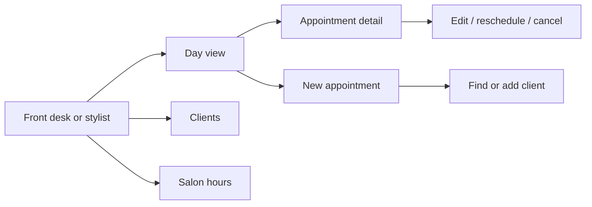

# chairflow

chairflow is a calm, minimal appointment book for a small family-run hair salon. It replaces outdated or bloated salon software with a few welcoming screens. It is deliberately **not** an ERP. Every feature must earn its place, and the voice of the UI ("A moment in the chair", "Make room for someone.") is part of the product. It is a Rails 8 monolith on SQLite with Hotwire (Turbo + Stimulus) and Tailwind, built by one developer in small, frequently committed steps.

> **Status (Sep 30, 2026):** clean-slate start on `main`. The earlier POC is preserved on `archive/poc-v1` (tag `poc-v1`) and nothing from it, including its lode, is carried forward. `Stylist`, `Service`, `Client`, `Appointment`, `AppointmentService`, and `SalonDay` are implemented, including overlap prevention and seeded salon hours (roadmap phase 1 underway; availability is not yet); everything else in this lode still describes the **planned MVP**. Code is the source of truth wherever the two disagree.

## MVP scope
The normal business flows, and nothing more: **see the day, book (one or more services), edit or reschedule, cancel, add or find clients** (with a warning when a new client looks like a duplicate), and **set the salon's opening hours**. Everything else is listed under "After MVP" in [plans/roadmap.md](plans/roadmap.md).

## Where to look next
[terminology.md](terminology.md) · [practices.md](practices.md) · [scheduling/summary.md](scheduling/summary.md) · [booking/summary.md](booking/summary.md) · [ui/summary.md](ui/summary.md) · [plans/roadmap.md](plans/roadmap.md)
