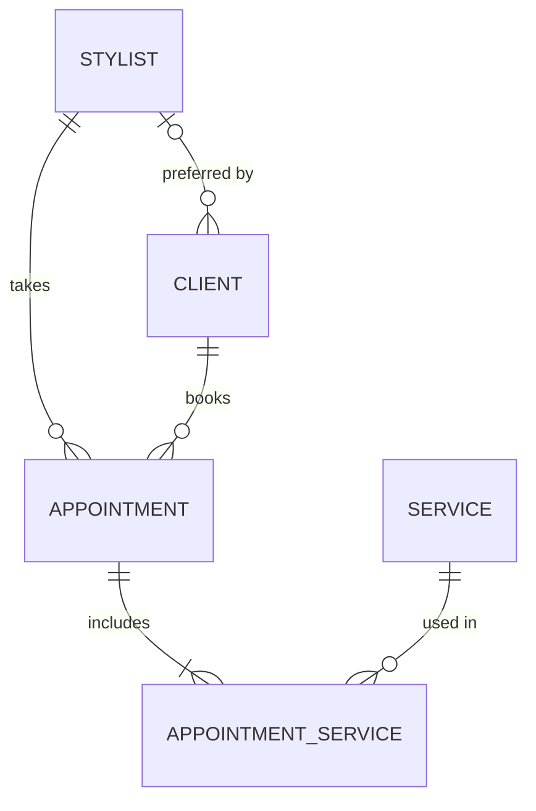

# Terminology

Code uses the **code term**. UI copy may use the warmer phrasing noted after it.

- **Salon** - the single business chairflow serves; owns the time zone (`America/New_York`).
- **Salon hours** - opening hours per weekday, set by the salon on the Salon hours page (default 8 AM to 6 PM every day). In the MVP this is the only bookable window for every stylist.
- **Salon day** - one weekday's hours or "closed" (code: `SalonDay`).
- **Stylist** - a team member who takes appointments; has a color swatch. Stylists also book appointments themselves when covering the desk.
- **Front desk** - whoever is booking at the moment: a desk person or a stylist.
- **Client** - a person who gets appointments; name required, email and phone optional.
- **Preferred stylist** - a client's usual stylist (UI: "Client preference"); a default, never a rule.
- **Possible duplicate** - an existing client with the same phone or email (or exactly the same name) as a client being added. We warn; we never merge.
- **Service** - something the salon offers (e.g. Cut & finish, Highlights, Blowout); has a default duration.
- **Appointment** - one client, one stylist, **one or more services**, one start and end time. UI eyebrow: "A moment in the chair".
- **Appointment service** - one service within an appointment, with its own duration (defaulted from the service, adjustable).
- **Booking** - the *act* of creating an appointment (verb). In code, the noun is always `Appointment`.
- **Duration** - total minutes of an appointment: the sum of its appointment services.
- **Open slot** - a start time where a stylist is free for the full duration within salon hours.
- **Slot grid** - the 15-minute step on which open slots and calendar rows align.
- **Day view** - the default calendar: one column per stylist for a single day.
- **Day planner** - the "Find the right moment" panel in the booking flow that lists open slots.
- **Visit notes** - free text attached to one appointment.
- **Cancelled** - an appointment that no longer blocks time but stays in history.
- **Eyebrow / headline / subline** - the three-part heading pattern (see [ui/voice-and-copy.md](ui/voice-and-copy.md)).
- **Swatch** - the soft color identifying a stylist across the UI.

