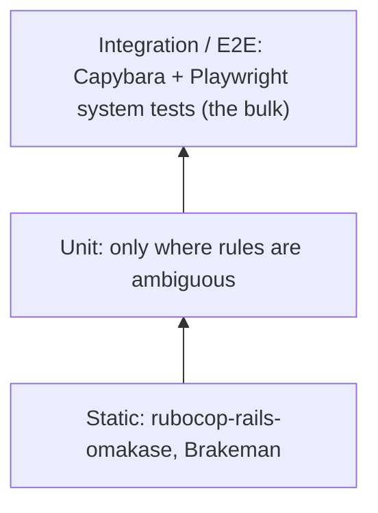

# Testing strategy

> Status: `test/application_system_test_case.rb` registers the `:playwright` driver. CI (`.github/workflows/ci.yml`, Rails' generated workflow) installs the matching Playwright browser before running `test:system`.

We follow Kent C. Dodds' **testing trophy**: static checks at the base, a few unit tests, and **most confidence from end-to-end system tests** that use the app the way the front desk does.



## Tools
- **Minitest** (Rails default, confirmed) with fixtures.
- **System tests** via Capybara driven by Playwright (`capybara-playwright-driver`, not `selenium-webdriver` — Rails' default `gem "selenium-webdriver"` was swapped out). This keeps everything in Ruby with transactional fixtures, while using Playwright's browser engine.
- The Playwright *browser* (Chromium) must be installed separately from the gem, at the version `Playwright::COMPATIBLE_PLAYWRIGHT_VERSION` names (this machine already had it cached under `~/Library/Caches/ms-playwright`; a fresh machine needs `npx playwright@<version> install --with-deps chromium`).
- CI: the GitHub Actions workflow Rails 8 generates (`.github/workflows/ci.yml`), with a step installing that Playwright browser before the `system-test` job's `bin/rails db:test:prepare test:system`.

```ruby
# test/application_system_test_case.rb
require "test_helper"

Capybara.register_driver(:playwright) do |app|
  Capybara::Playwright::Driver.new(app, browser_type: :chromium, headless: !ENV["HEADED"])
end

class ApplicationSystemTestCase < ActionDispatch::SystemTestCase
  driven_by :playwright
end
```

## What gets which kind of test
| Behavior | Test |
|---|---|
| Booking (one or several services), rescheduling, cancelling, adding a client inline, duplicate warning, viewing a day | System test |
| Live update when another screen books | System test (two sessions) |
| Open-slot computation, overlap rules, derived `ends_at`, DST wall clock, duplicate matching | Unit test |
| Copy and voice | Covered by system tests asserting on visible text |
| Controllers and helpers | Not tested directly; covered through system tests |

A unit test must name the ambiguity it resolves. If it only restates the code, delete it.

## Example system test
```ruby
# test/system/booking_test.rb
class BookingTest < ApplicationSystemTestCase
  test "front desk books a new client into an open slot" do
    travel_to Time.zone.local(2026, 9, 30, 8, 30)
    visit new_appointment_path

    select "Highlights", from: "Service"
    select "Melissa", from: "Stylist"
    within("#day_planner") { click_on "1:00 PM" }
    fill_in "Client", with: "Jane Doe"
    click_on "Add “Jane Doe” as a new client"
    click_on "Book appointment"

    assert_text "Booked. Jane Doe is in with Melissa at 1:00."
  end
end
```

## Fixtures
Fixtures mirror a realistic week: stylists Melissa and Devon (plus an inactive one, Pat, for `active`-scope tests), a few services, clients Ava and Noah, and a booked appointment (Ava with Melissa, Thursday). `salon_days` fixtures cover all seven weekdays, Monday closed and the rest open 8 AM to 6 PM — the one stable closed day a test can rely on, see [../scheduling/salon-hours.md](../scheduling/salon-hours.md).

## Dev seed data (`db/seeds.rb`)
Separate from fixtures, not loaded by tests — this is what running the app locally shows. Same shape as the fixtures (three stylists, five services, Monday closed), plus four clients and, for each of *today and tomorrow* (skipping either if closed), one appointment per stylist: a short single-service one, a combined two-service one, and a long one — enough variety to see card heights, multi-service copy, and swatch colors at a glance without opening a browser dev-tools inspector. Appointments are anchored to `Date.current`/`Date.current + 1.day`, not fixed calendar dates, so the data stays meaningful regardless of when `bin/rails db:seed` runs; re-running it is idempotent (`Appointment.find_or_create_by!` on client/stylist/starts_at, `SalonDay.find_or_initialize_by` + explicit attribute assignment so an existing row still converges to the intended `closed` value). As real UI gets built, extend this file rather than leaving it static, so the dev server keeps showing working examples of whatever exists.

## Per task
Every roadmap task names its test under **Done when**. A task isn't done until that test is green in the same commit.
