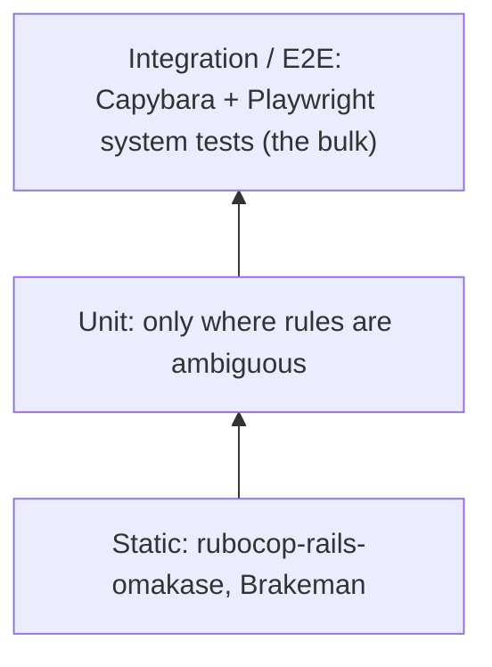

# Testing strategy

> Status: planned, not yet implemented.

We follow Kent C. Dodds' **testing trophy**: static checks at the base, a few unit tests, and **most confidence from end-to-end system tests** that use the app the way the front desk does.



## Tools
- **Minitest** (Rails default, confirmed) with fixtures.
- **System tests** via Capybara driven by Playwright (`capybara-playwright-driver`). This keeps everything in Ruby with transactional fixtures, while using Playwright's browser engine.
- CI: the GitHub Actions workflow that Rails 8 generates, with Playwright browsers installed.

```ruby
# test/application_system_test_case.rb
require "test_helper"

Capybara.register_driver(:playwright) do |app|
  Capybara::Playwright::Driver.new(app, browser_type: :chromium, headless: !ENV["HEADED"])
end

class ApplicationSystemTestCase < ActionDispatch::SystemTestCase
  driven_by :playwright
end
```
Verify the driver setup and trace-on-failure API when scaffolding; this is a sketch.

## What gets which kind of test
| Behavior | Test |
|---|---|
| Booking (one or several services), rescheduling, cancelling, adding a client inline, duplicate warning, viewing a day | System test |
| Live update when another screen books | System test (two sessions) |
| Open-slot computation, overlap rules, derived `ends_at`, DST wall clock, duplicate matching | Unit test |
| Copy and voice | Covered by system tests asserting on visible text |
| Controllers and helpers | Not tested directly; covered through system tests |

A unit test must name the ambiguity it resolves. If it only restates the code, delete it.

## Example system test
```ruby
# test/system/booking_test.rb
class BookingTest < ApplicationSystemTestCase
  test "front desk books a new client into an open slot" do
    travel_to Time.zone.local(2026, 9, 30, 8, 30)
    visit new_appointment_path

    select "Highlights", from: "Service"
    select "Melissa", from: "Stylist"
    within("#day_planner") { click_on "1:00 PM" }
    fill_in "Client", with: "Jane Doe"
    click_on "Add “Jane Doe” as a new client"
    click_on "Book appointment"

    assert_text "Booked. Jane Doe is in with Melissa at 1:00."
  end
end
```

## Fixtures
Fixtures mirror a realistic week: three stylists (Lauren, Melissa, Zoe), standard services, and a few clients with appointments. Salon days are open 8 AM to 6 PM every day, matching the seeds. The same data seeds development (`db/seeds.rb` loads fixtures).

## Per task
Every roadmap task names its test under **Done when**. A task isn't done until that test is green in the same commit.
