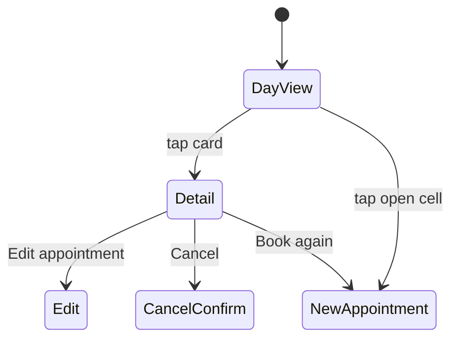

# Calendar views

> Status: the day view below is implemented at `/` (`CalendarController#index`), except: no date param yet (always `Date.current`), no header (arrows/Today/count), no closed-day message, and cards aren't links yet (no appointment route exists). All of that is still planned. Appointment detail (dialog) and live updates, further down this file, are also still planned.

## Day view (default, currently always today's date; `?date=` is still planned)
- One column per active stylist (`app/views/calendar/_column.html.erb`), named with their swatch dot. Cards are wide enough to show full names.
- Rows follow the 15-minute slot grid from salon opening to closing (`SalonDay.hours_on(date)`); a closed or hourless day renders the column with no grid at all (not yet the "We're closed today" message — see the Status line above).
- Still to add: header (date, ← → arrows, "Today", count), tapping an empty cell to start a new appointment, and the Day | Week toggle (after the MVP, with the week view).

Cards are placed with CSS grid rows computed from time, via `CalendarHelper` (`app/helpers/calendar_helper.rb`):

```erb
<%# app/views/calendar/_column.html.erb (excerpt) %>
<div class="grid" style="grid-template-rows: repeat(<%= day_slot_count(window) %>, minmax(1.25rem, auto))">
  <% appointments.each do |appointment| %>
    <div class="rounded-lg border-l-[3px] px-3 py-2 <%= swatch_classes(stylist) %>"
         style="grid-row: <%= day_row_for(window, appointment.starts_at) %> / span <%= day_span_for(appointment.duration) %>">
      <p class="font-medium text-ink"><%= appointment.client.name %></p>
      <p class="text-sm text-muted">
        <%= appointment.services.map(&:name).to_sentence %> · <%= appointment.starts_at.strftime("%-l:%M") %>
      </p>
    </div>
  <% end %>
</div>
```
`window` is `SalonDay.hours_on(date)` (a `Range` of `TimeWithZone`, or `nil`). `day_row_for` = `((time - window.begin) / 15.minutes).to_i + 1`; `day_span_for` = `(duration / 15.minutes).ceil`. Cards aren't wrapped in `link_to appointment_path(...)` yet — that route doesn't exist until appointment detail (below) is built; until then each stylist column carries `id="stylist-column-#{stylist.id}"` so tests can scope into it.

## Week overview (after MVP)
Planned shape, for when it's picked up: one column per day showing each stylist's load and next opening, tapping through to the day. A single-stylist filter shows a full 7-column grid. The POC's 21-column grid is not repeated.

## Appointment detail (dialog)
Kept close to the POC, which worked well: eyebrow "A moment in the chair", client name, services; date and time range; duration and zone; stylist and client preference; contact as links; visit notes; **Done** and **Edit appointment**. Additions: **Cancel appointment** (quiet, secondary) and **Book again** (prefills client, stylist, and service).



## Live updates
Other screens update without a reload:

```ruby
class Appointment < ApplicationRecord
  # One shared stream, so creates, edits, and cancels all refresh every open calendar.
  # (broadcasts_refreshes only sends creates to the plural stream; updates go to the record's own stream.)
  after_commit -> { broadcast_refresh_later_to "calendar" }
end
```
```erb
<%= turbo_stream_from "calendar" %>
<% turbo_refreshes_with method: :morph, scroll: :preserve %>
```
