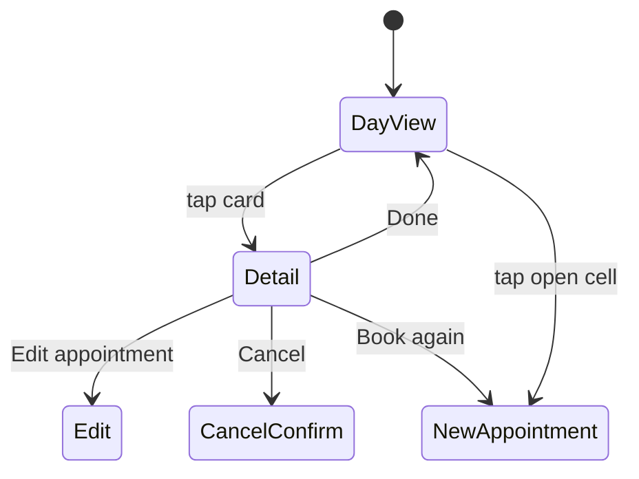

# Calendar views

> Status: the day view and appointment detail dialog below are both implemented. Live updates, further down this file, are still planned.

## Day view (default; `/?date=2026-10-01`, any ISO date, an invalid or missing one falls back to today)
- Header: ← → arrows and "Today" (all three are plain links to `root_path(date: ...)`), the date (`"Wednesday, September 30"`), and a count (`"3 appointments"`, via `pluralize`).
- One column per active stylist (`app/views/calendar/_column.html.erb`), named with their swatch dot. Cards are wide enough to show full names.
- Rows follow the 15-minute slot grid from salon opening to closing (`SalonDay.hours_on(date)`). A closed (or hourless) day replaces the whole stylist grid with "We're closed today. A well-earned rest." instead of rendering empty columns.
- Still to add: tapping an empty cell to start a new appointment, and the Day | Week toggle (after the MVP, with the week view).

Cards are placed with CSS grid rows computed from time, via `CalendarHelper` (`app/helpers/calendar_helper.rb`):

```erb
<%# app/views/calendar/_column.html.erb (excerpt) %>
<div id="stylist-column-<%= stylist.id %>" class="flex h-full flex-col">
  <p>...stylist name and swatch dot...</p>

  <div class="relative grid flex-1 gap-y-1 rounded-xl border border-line bg-surface"
       style="grid-template-rows: repeat(<%= day_slot_count(window) %>, minmax(1.25rem, auto))">
    <% appointments.each do |appointment| %>
      <%= link_to appointment_path(appointment),
            data: { turbo_frame: "modal" },
            class: "block rounded-lg border-l-[3px] px-3 py-2 #{swatch_classes(stylist)}",
            style: "grid-row: #{day_row_for(window, appointment.starts_at)} / span #{day_span_for(appointment.duration)}" do %>
        <p class="font-medium text-ink"><%= appointment.client.name %></p>
        <p class="text-sm text-muted">
          <%= appointment.services.map(&:name).to_sentence %> · <%= appointment.starts_at.strftime("%-l:%M") %>
        </p>
      <% end %>
    <% end %>
  </div>
</div>
```
`window` is `SalonDay.hours_on(date)` (a `Range` of `TimeWithZone`, or `nil`). `day_row_for` = `((time - window.begin) / 15.minutes).to_i + 1`; `day_span_for` = `(duration / 15.minutes).ceil`. Each stylist column also carries `id="stylist-column-#{stylist.id}"` so tests can scope into it.

**`gap-y-1` on the grid matters**: without it, two back-to-back appointments for the same stylist render with touching edges — visually one card, not two. A CSS Grid item that spans multiple row tracks absorbs any `row-gap` *within* its own span into its own height (so a single card stays one continuous box, not sliced by internal gaps); the gap only becomes visible at the boundary between two different items. That's why a uniform `gap-y-1` on the whole grid is enough — it doesn't need to be conditional on "is this card adjacent to another."

**All three columns end at the same height, on purpose.** Each stylist's bordered box has its own `grid-template-rows` and sizes to its own content (`minmax(1.25rem, auto)` lets a row grow if a card needs more room than its nominal slot) — three independent grids with different appointments naturally compute different total heights. The outer day view's 3-column grid (`app/views/calendar/index.html.erb`) stretches each stylist's *wrapper* div to match the tallest one (CSS Grid's default `align-items: stretch`, since none of them declare an explicit height), but that stretch doesn't reach the bordered box nested one level inside the wrapper — it still sizes to its own content unless told otherwise. `flex h-full flex-col` on the wrapper plus `flex-1` on the bordered box closes that gap: the box grows to fill whatever height the wrapper was stretched to, so all three read as one continuous row of equal-height cards even when their appointment counts differ.

**Deliberately no hour gridlines or a labeled time-axis gutter.** Considered and set aside: every card already states its own start time, a small salon's day is short enough not to need a ruler to stay oriented, and a persistent grid of hour lines would add visual density that cuts against this app's calm, minimal design language (see [../practices.md](../practices.md), [../summary.md](../summary.md)) for a problem this app doesn't clearly have. Hey Calendar's *week* view skips this entirely for the same reason; its day view does carry an hour ruler plus a current-time indicator, but that's a different, narrower idea — see "Later" below.

## Later
- A current-time indicator (a line across all stylist columns at "now," shown only when viewing today) — not built, but distinct from the gridlines idea above: it directly serves the "front desk lives in today... who's in now" principle in [../practices.md](../practices.md), rather than adding general-purpose visual density. Worth its own small task if picked up.

## Week overview (after MVP)
Planned shape, for when it's picked up: one column per day showing each stylist's load and next opening, tapping through to the day. A single-stylist filter shows a full 7-column grid. The POC's 21-column grid is not repeated.

## Appointment detail (dialog)
`AppointmentsController#show` (routes: `resources :appointments, only: [:show]`) renders `app/views/appointments/show.html.erb` into the `modal` Turbo Frame: eyebrow "A moment in the chair", client name, services, date and time range, stylist, and a **Done** button that turbo-visits back to `root_path` (`data: { turbo_frame: "_top" }`, so it replaces the whole page rather than the frame). The `<dialog>` needs `app/javascript/controllers/modal_controller.js` (`connect() { this.element.showModal() }`) to render as a true modal with a backdrop — the `open` attribute alone would only show it inline. The dialog also needs an explicit `m-auto` class to center itself: Tailwind's preflight resets `margin: 0` on all elements, which strips the browser's default centering for `dialog:modal`.

Still planned: visit notes, contact as `mailto:`/`tel:` links, client preference, **Edit appointment**, **Cancel appointment**, and **Book again** (prefills client, stylist, and service) — each arrives with its own roadmap task.

**New appointment reuses this same modal mechanism** (`modal` Turbo Frame, `<dialog data-controller="modal">`, `m-auto` centering) — see [../booking/summary.md](../booking/summary.md) for why the form and its "Never mind" link both need `data: { turbo_frame: "_top" }` to break out of the frame on submit/cancel, which "Done" above also relies on.



## Live updates
Other screens update without a reload:

```ruby
class Appointment < ApplicationRecord
  # One shared stream, so creates, edits, and cancels all refresh every open calendar.
  # (broadcasts_refreshes only sends creates to the plural stream; updates go to the record's own stream.)
  after_commit -> { broadcast_refresh_later_to "calendar" }
end
```
```erb
<%= turbo_stream_from "calendar" %>
<% turbo_refreshes_with method: :morph, scroll: :preserve %>
```
