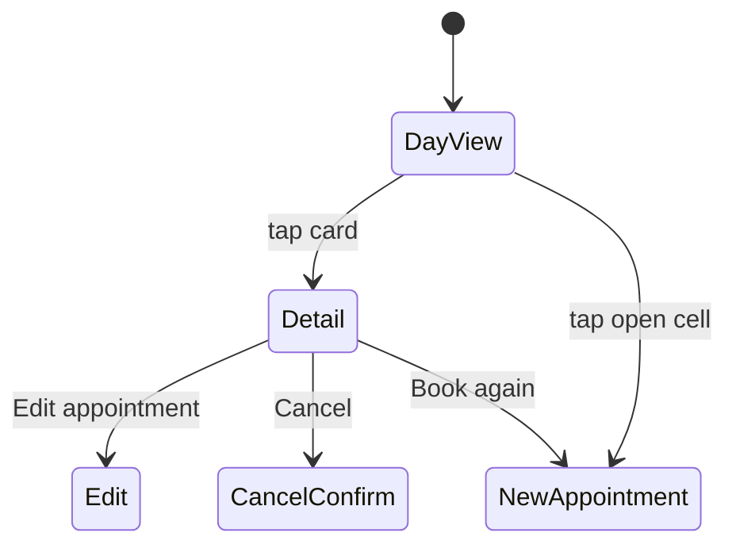

# Calendar views

> Status: planned, not yet implemented. Day view is the default; judge it in practice.

## Day view (default, `/calendar?date=`)
- One column per active stylist, named with their swatch dot. Cards are wide enough to show full names.
- Rows follow the 15-minute slot grid from salon opening to closing (`SalonDay.hours_on(date)`), widened if any appointment falls outside them. A closed day shows "We're closed today. A well-earned rest."
- Header: date, ← → arrows, "Today", count ("19 appointments"). The Day | Week toggle arrives with the week view after the MVP.
- Tapping an empty open cell starts a new appointment prefilled with that stylist and time.

Cards are placed with CSS grid rows computed from time:

```erb
<%# app/views/calendars/_column.html.erb (excerpt) %>
<div class="grid" style="grid-template-rows: repeat(<%= day.slot_count %>, minmax(1.5rem, auto))">
  <% appointments.each do |appt| %>
    <%= link_to appointment_path(appt),
          data: { turbo_frame: "modal" },
          class: "rounded-lg border-l-[3px] px-3 py-2 #{swatch_classes(appt.stylist)}",
          style: "grid-row: #{day.row_for(appt.starts_at)} / span #{day.span_for(appt)}" do %>
      <p class="font-medium text-ink"><%= appt.client.name %></p>
      <p class="text-sm text-muted"><%= appt.services.map(&:name).to_sentence %> · <%= appt.starts_at.strftime("%-l:%M") %></p>
    <% end %>
  <% end %>
</div>
```

`row_for` = `((time - day_start) / 15.minutes).to_i + 1`, and `span_for` = duration / 15 minutes.

## Week overview (after MVP)
Planned shape, for when it's picked up: one column per day showing each stylist's load and next opening, tapping through to the day. A single-stylist filter shows a full 7-column grid. The POC's 21-column grid is not repeated.

## Appointment detail (dialog)
Kept close to the POC, which worked well: eyebrow "A moment in the chair", client name, services; date and time range; duration and zone; stylist and client preference; contact as links; visit notes; **Done** and **Edit appointment**. Additions: **Cancel appointment** (quiet, secondary) and **Book again** (prefills client, stylist, and service).



## Live updates
Other screens update without a reload:

```ruby
class Appointment < ApplicationRecord
  # One shared stream, so creates, edits, and cancels all refresh every open calendar.
  # (broadcasts_refreshes only sends creates to the plural stream; updates go to the record's own stream.)
  after_commit -> { broadcast_refresh_later_to "calendar" }
end
```
```erb
<%= turbo_stream_from "calendar" %>
<% turbo_refreshes_with method: :morph, scroll: :preserve %>
```
