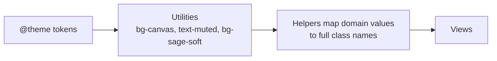

# Design tokens

> Status: the `@theme` block below and `StylistsHelper` (`app/helpers/stylists_helper.rb`) are both implemented — used by the day view's stylist columns. `StylistsHelper` also has `SWATCH_DOT_CLASSES`/`swatch_dot_classes`, a solid-color companion to `SWATCH_CLASSES` for the small dot next to each stylist's name (not shown below). The color values are approximations from the POC screenshots; tune them in the browser.

## Theme (Tailwind v4)
Tokens live in the Tailwind entry file as `@theme` variables, so utilities like `bg-canvas` and `text-muted` exist.

```css
/* app/assets/tailwind/application.css */
@import "tailwindcss";

@theme {
  --color-canvas: #f5f4f0;   /* page background, warm off-white */
  --color-surface: #ffffff;  /* cards, dialogs */
  --color-line: #e7e5e0;     /* hairlines and borders */
  --color-ink: #1f2421;      /* primary text */
  --color-muted: #77776f;    /* secondary text, eyebrows */
  --color-pine: #2f4a3f;     /* the one accent: primary buttons, today marker */
  --color-pine-hover: #253b32;

  /* stylist swatches: soft fill + stronger edge */
  --color-lavender-soft: #ece8f4; --color-lavender: #9c93c4;
  --color-sage-soft: #e8efe9;     --color-sage: #7fa08a;
  --color-clay-soft: #f3e6dd;     --color-clay: #c99273;
  --color-sky-soft: #e4edf3;      --color-sky: #7f9fb8;
  --color-sand-soft: #f2ecdc;     --color-sand: #bba36e;
}
```

## Swatches belong to stylists, not names
A `Stylist` has a `swatch` string. The helper maps it to **complete** class names, because Tailwind only generates classes it can find written out in full in the source.

```ruby
# app/helpers/stylists_helper.rb
module StylistsHelper
  SWATCH_CLASSES = {
    "lavender" => "bg-lavender-soft border-lavender",
    "sage"     => "bg-sage-soft border-sage",
    "clay"     => "bg-clay-soft border-clay",
    "sky"      => "bg-sky-soft border-sky",
    "sand"     => "bg-sand-soft border-sand"
  }.freeze

  def swatch_classes(stylist) = SWATCH_CLASSES.fetch(stylist.swatch)
end
```

Never write `"bg-#{swatch}-soft"`; the class won't exist in production CSS.



## Shape and type
- Cards: `rounded-2xl bg-surface border border-line`. Buttons: `rounded-xl`. Appointment cards: `rounded-lg` with a 3px left border in the swatch edge color.
- Type: the system font stack (Tailwind's default `font-sans`): San Francisco on Apple devices, Segoe UI on Windows, Roboto on Android. It loads instantly and feels native; a custom typeface can be revisited after the MVP. Headlines use `tracking-tight`; eyebrows use `uppercase tracking-[0.25em] text-xs`.
- Primary button: `bg-pine text-white hover:bg-pine-hover`. Secondary: `border border-line bg-surface`.
- Styled selects: `appearance-none` plus a custom chevron. Never ship the browser default next to styled inputs. Implemented as `ApplicationHelper#select_chevron` (an inline SVG, absolutely positioned inside a `relative` wrapper around the `collection_select`) — see `app/views/appointments/_form.html.erb` for the pattern to repeat on any future select.
- Color never carries meaning alone: every swatch also appears next to the stylist's name.
