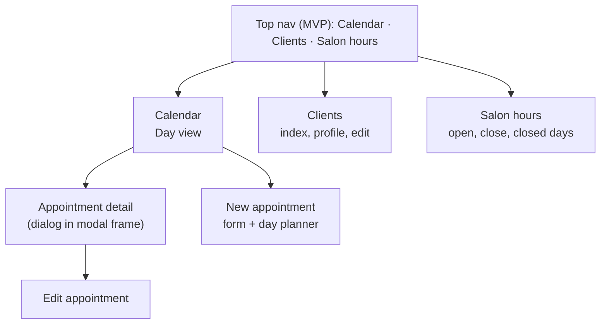

# UI overview

> Status: the page skeleton is implemented — layout, nav, page header partial, flash, Tailwind tokens. The nav shows only **Calendar**, the one page that exists; **Clients** and **Salon hours** belong in `shared/_nav.html.erb` once those controllers exist, not before — a nav link to a route that doesn't exist breaks the page it's on. `calendar#index` renders the full day view (stylist columns, appointment cards placed by time, date navigation, closed-day message) — see [calendar-views.md](calendar-views.md) for what's still missing (clickable cards, tapping an empty cell to book).

chairflow looks like a well-kept paper appointment book: a warm off-white page, one deep pine-green accent, soft stylist swatches, and plenty of room. It should feel calm at 9 AM on a busy Saturday.



## Page anatomy
Every page follows the same skeleton:

```erb
<%# app/views/layouts/application.html.erb (excerpt) %>
<body class="bg-canvas text-ink antialiased">
  <%= render "shared/nav" %>
  <main class="mx-auto max-w-6xl px-6 py-12">
    <%= render "shared/flash" %>
    <%= yield %>
  </main>
  <%= turbo_frame_tag "modal" %>
</body>
```

Team schedule, Services, Sign out, and the week view come after the MVP.

Pages then render the header partial (see [voice-and-copy.md](voice-and-copy.md)) followed by one primary card.

## Files
- [voice-and-copy.md](voice-and-copy.md) - the heading pattern, tone rules, and copy for each page
- [design-tokens.md](design-tokens.md) - colors, swatches, type, radius, and Tailwind v4 theme
- [calendar-views.md](calendar-views.md) - day view and appointment detail

## Known POC problems not to repeat
- A week grid with 21 narrow columns (7 days × 3 stylists), which truncated every name.
- A stray tooltip ("Zoe") overlapping the page eyebrow.
- Unstyled native `<select>` elements next to styled inputs.
- The primary button below the fold on the booking form.
