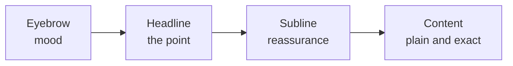

# Voice and copy

> Status: `shared/_page_header.html.erb` below is implemented verbatim. Page copy in the table is proposed and can change freely as pages are actually built; only Calendar (day)'s row is in use so far.

This file is written for the agent: **use these patterns when adding or changing any page.**

## The heading pattern
Every page opens with three parts:
1. **Eyebrow**: small caps, widely tracked, muted. A mood or context, not a label ("YOUR DAY, WELL ARRANGED").
2. **Headline**: large, tight, ends with a period when it's a sentence ("The appointment book.").
3. **Subline** (optional): one soft sentence that reassures ("A little more clarity. A little room to breathe.").

```erb
<%# app/views/shared/_page_header.html.erb %>
<header class="mb-10">
  <p class="text-xs font-medium uppercase tracking-[0.25em] text-muted"><%= eyebrow %></p>
  <h1 class="mt-3 text-5xl font-semibold tracking-tight text-ink"><%= headline %></h1>
  <% if local_assigns[:subline] %>
    <p class="mt-3 text-lg text-muted"><%= subline %></p>
  <% end %>
</header>
```

```erb
<%= render "shared/page_header", eyebrow: "New appointment", headline: "Make room for someone." %>
```

## Tone rules
- Warm, short, human. Write like a thoughtful salon owner, not a software vendor.
- Avoid system words such as *record, entity, resource, submit, invalid, error occurred, successfully*.
- Buttons are plain verbs: "Book appointment", "Save changes", "Never mind", "Done".
- Empty states are gentle and true: "Nothing noted for this visit." "Nothing booked yet. A quiet start."
- Errors name the problem and point to the next step: "Melissa is with Ava until 12:00. Try 12:00 or later?"
- Confirmations restate what happened in human terms: "Booked. Ava's in with Melissa at 9:00."
- Keep the playfulness in headings and empty states. Data (times, names, durations) stays plain and exact.



## Page copy
| Page | Eyebrow | Headline | Subline |
|---|---|---|---|
| Calendar (day) | Your day, well arranged | The appointment book. | A little more clarity. A little room to breathe. |
| Calendar (week, after MVP) | Your week, well arranged | The appointment book. | (same) |
| Appointment detail | A moment in the chair | *client name* | *service* |
| New appointment | New appointment | Make room for someone. | - |
| Day planner panel | Find the right moment | *date* | Your stylist's day · *duration* |
| Edit appointment | A change of plans | Let's find a better time. | - |
| Cancel confirm | - | Let this one go? | It stays in their history. |
| Possible duplicate | - | *Looks like Ava Thompson might already be here.* | Same phone. |
| Clients | The people who come back | Your clients. | Everyone who's sat in your chair. |
| Client profile | A familiar face | *client name* | *preferred stylist* |
| Team schedule (after MVP) | Who's in, and when | The team's week. | Hours and breaks, set once and trusted. |
| Salon hours | When the doors are open | Salon hours. | Set them once. Change them whenever life does. |
| Services (after MVP) | What you offer | The menu. | Every service, and how long it takes. |
| Sign in (after MVP) | Welcome back | Good to see you. | - |
| Not found | Hmm | We can't find that one. | It may have been moved or cancelled. |

Eyebrows are written in sentence case in code and uppercased with CSS, so screen readers don't read them as shouting.
